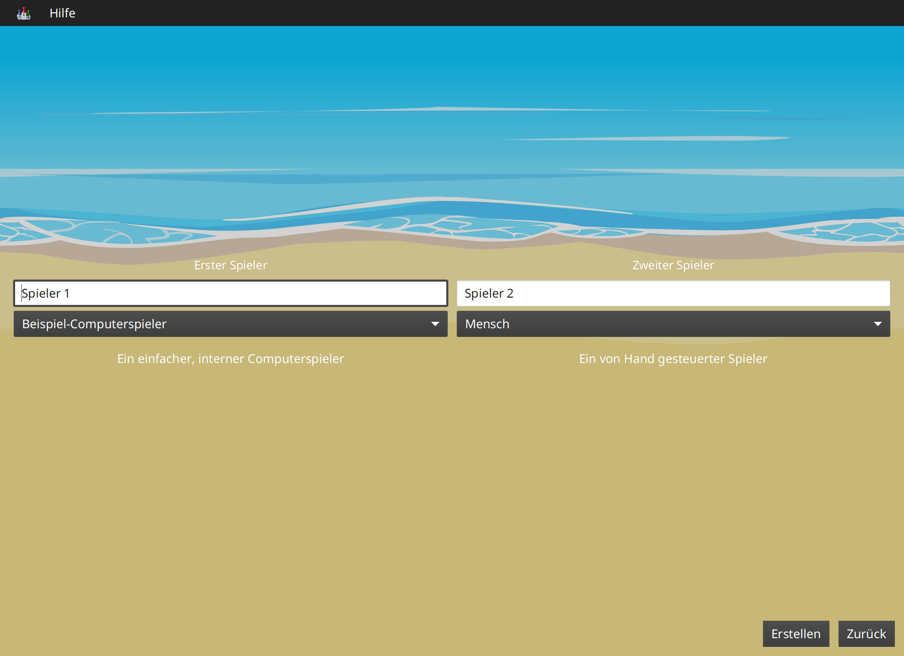
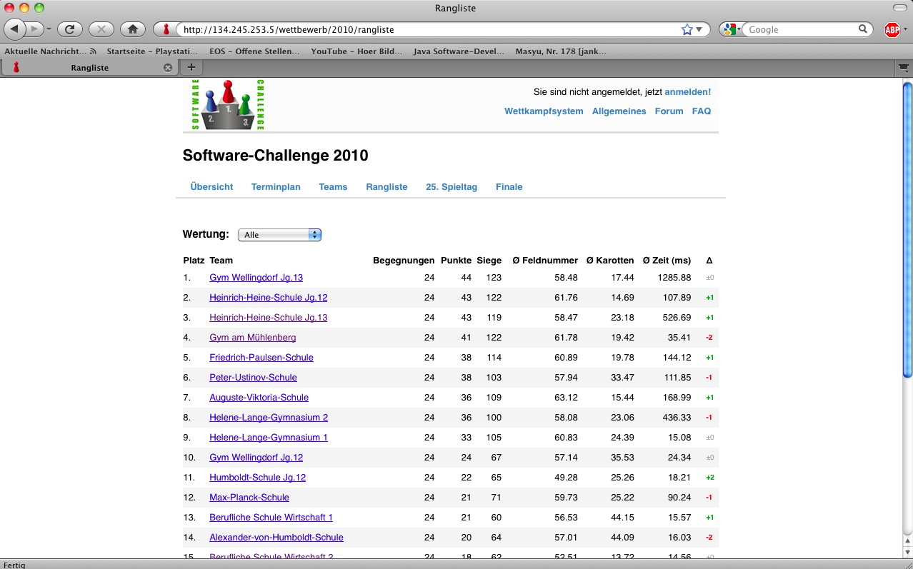

Ziel dieser Dokumentation ist es, alle Informationen über die
Software-Challenge an einer Stelle zu bündeln. Hier können sich Lehrer
und Kursleiter über den Zweck der Software-Challenge informieren. Für
die teilnehmenden Teams ist hier alles dokumentiert, was für die
Teilnahme am Wettbewerb benötigt wird.

[PDF-Version dieses Dokumentes](index.pdf)

Wir freuen uns über sämtliche Verbesserungsvorschläge.  
Die Dokumentation kann [direkt auf
GitHub](https://github.com/software-challenge/docs) editiert werden,
einzige Voraussetzung ist eine kostenlose Registrierung bei GitHub. Ist
man angemeldet, kann man ein Dokument auswählen (ein guter Startpunkt
ist die Datei
[index.md](https://github.com/software-challenge/docs/blob/main/index.md)
welche Verweise auf alle Sektionen der Dokumentation enthält) und dann
auf den Stift oben rechts klicken. Damit wird von GitHub automatisch ein
Fork und ein Pull Request erstellt.  
Alternativ auch gern eine E-Mail an <info@software-challenge.de> oder
eine Nachricht im [Discord](https://discord.gg/jhyF7EU).

Die Dokumentation des aktuellen Spiels Ostseeschach finden Sie in
separaten Dokumenten:

-   [Ostseeschach Spielregeln](spiele/ostseeschach/regeln.md)

-   [Ostseeschach
    XML-Dokumentation](spiele/ostseeschach/xml-dokumentation.md)

Die Dokumentation ist in mehrere Abschnitte aufgeteilt. Sie können sie
gezielt oder von Anfang bis Ende lesen. Über einen Link am Ende jedes
Abschnittes kommen Sie zum nächsten Abschnitt oder wieder auf diese
Übersichtsseite.

# Die Software-Challenge

Die Software-Challenge ist ein Schulprojekt, das durch das Institut für
Informatik der CAU Kiel veranstaltet wird und das durch zahlreiche
Unternehmen, die Prof. Dr. Werner Petersen-Stiftung sowie das
Ministerium für Wissenschaft, Wirtschaft und Verkehr des Landes
Schleswig-Holstein finanziert wird. In Zusammenarbeit mit den Gymnasien
und Gesamtschulen, dem Institut für Informatik sowie den Firmen soll in
diesem Projekt der Informatik-Unterricht in praxisbezogener Weise
mitgestaltet und dadurch aufgewertet werden. Gegenstand der
Software-Challenge ist ein Programmierwettbewerb, der während des
gesamten Schuljahres läuft, und der den Schülerinnen und Schülern die
Möglichkeit bietet, mit Spaß und Spannung sowie mit kompetenter
Begleitung in die Welt der Informatik einzusteigen. Am Ende der
Entwicklungsphase schickt jedes Team (Kurs oder AG) einen selbst
programmierten Computerspieler für das Spiel in den Wettkampf. Dieser
Wettkampf besteht zunächst aus einer kompletten Meisterschaft (jeder
gegen jeden) und anschließend aus einem Finale der 8 führenden Teams
(Final Eight). Als Preise winken neben zahlreichen Sachpreisen auch
Stipendien für die besten Schülerinnen und Schüler. In jeder Phase des
Projekts wird in der Presse und im Radio über den jeweils aktuellen
Stand berichtet.

## Teilnahmebedingungen und Registrierung

Teilnahmeberechtigt sind alle zur Hochschulreife führenden Schulen der
Bundesrepublik Deutschland. Jede Schule kann sich dabei mit mehreren
Kursen oder AGs (höchstens 3 Teams) anmelden. Jedes Team soll dabei aus
mindestens 3 SchülerInnen und einer betreuenden Lehrkraft bestehen.
Jeder Kurs bzw. jede AG darf nur ein Team anmelden. Dabei kann es in der
Anfangsphase durchaus Sinn machen, intern in einem Team mehrere Gruppen
zu bilden, um z.B. unterschiedliche Strategien zu testen und
Computerspieler zu entwickeln. Spätestens zu Beginn der Wettkampfphase
muss sich das Team jedoch auf einen Computerspieler einigen, der dann in
den Wettkampf geschickt und dann eventuell noch gemeinsam
weiterentwickelt wird. In begründeten Einzelfällen kann die
Wettkampfleitung Ausnahmen von den zuvor genannten Regeln zulassen.

Zur Zeit nehmen pro Schuljahr etwa 100 Teams bundesweit an der
Software-Challenge teil. Es werden dabei neben zahlreichen Sachpreisen
auch etwa 100 Stipendien (6 Monate je 300 Euro) an die besten 100
Schülerinnen und Schüler vergeben.

Das Anmeldeverfahren sieht etwa wie folgt aus. Genaue Termine des
aktuellen Zeitraumes finden sich auf der [Website unter
Termine](http://www.software-challenge.de/de/termine).

Ab April können interessierte SchulleiterInnen, Lehrkräfte und
SchülerInnen ihre Schulen und Teams für die Teilnahme an der
Software-Challenge unverbindlich anmelden. Diese Interessenten werden
dann über wichtige Termine und andere relevanten Dinge informiert.

Gegen Ende der Anmeldungsphase werden wir dann mit den registrierten
Interessenten in Verbindung treten. Dann soll eine (relativ)
verbindliche Anmeldung erfolgen, so dass wir darauf aufbauend unsere
Ressourcen planen können.

Die endgültige Anmeldung soll dann zu Beginn des Schuljahres erfolgen.

Um eine gute Planung und damit einen erfolgreichen Ablauf zu
ermöglichen, sind wir darauf angewiesen, dass die interessierten
SchulleiterInnen, Lehrkräfte und SchülerInnen ihre Schulen und Teams
möglichst frühzeitig registrieren und erforderlichenfalls ihre Daten
aktualisieren.

## Die Aufgabe

Die Software-Challenge basiert jedes Jahr auf einem Brettspiel, für das
ein Computerspieler geschrieben werden soll und das entweder selbst
entwickelt oder auf Basis eines existierenden Brettspiels modifiziert
wird. Im letzteren Fall werden wir durch die Spiel-Verlage unterstützt,
indem diese uns die Genehmigung erteilen und Grafiken zur Verfügung
stellen. Bei der Entwicklung bzw. Modifizierung der Spiele versuchen wir
zu erreichen, dass die Spiele interessant, abwechslungsreich und nicht
zu kompliziert sind und dass die Glückskomponente nicht dominiert. Ein
sehr guter Computerspieler soll sich also langfristig gegen schwächere
durchsetzen, wobei es durchaus vorkommen darf, dass er bei viel Pech
auch mal verliert.

# Der Spielleiter (Server)

Die beiden [Computerspieler](#der-computerspieler) kommunizieren nicht
direkt miteinander, sondern übertragen ihre Nachrichten über einen
Mittelmann: den Spielleiter. Dadurch ist zum einen sichergestellt, dass
man seinen Gegner nicht mit invaliden Nachrichten belästigen kann, zum
anderen sorgt der Spielleiter dafür, dass sich die Kontrahenten an die
Spielregeln halten.

Der Spielleiter ist direkt im [Wettkampfsystem](#das-wettkampfsystem)
integriert, so dass alle Turnierspiele regelkonform gespielt werden. Zum
Testen des eigenen Computerspielers gibt es eine spezielle Version des
Spielleiters, die im [Downloadbereich der
Website](https://software-challenge.de/dokumentation-und-material)
heruntergeladen werden kann. Diese Download-Version enthälft eine
grafische Oberfläche, durch die man das Spiel gut verfolgen und sogar
als Mensch mitspielen kann.

## System vorbereiten und Spielleiter starten

Die einzige Vorraussetzung ist, dass auf dem Rechner mindestens die
Laufzeitumgebung für Java 9 installiert ist. Siehe [Installation von
Java](#installation-java).

Nach der erfolgreichen Installation kann man den Server durch einen
Doppelklick auf die Datei `software-challenge-gui` starten.

## Die Programmoberfläche

Die Programmoberfläche besteht aus einer Menüleiste oben sowie der
Spielfläche darunter.

Unter dem ersten Menüpunkt (Symbol der Software-Challenge) findet man
alle grundlegenden Aktionen.

### Ein neues Spiel erstellen

Um ein Spiel zu spielen, muss zunächst "Neues Spiel starten" angeklickt
werden.

In diesem Fenster werden die Spieler ausgewählt, die an dem Spiel
teilnehmen sollen. Für jeden Spieler gibt es folgende Optionen:

Text-Eingabefeld: Hier kann für jeden Spieler ein Name eingegeben
werden, der dann im Spiel angezeigt wird.

Spielertyp: Es kann zwischen 4 verschiedenen Spielertypen gewählt
werden:

Mensch  
Ein menschlicher Spieler, der über die Programmoberfläche spielt.

Beispiel-Computerspieler  
Ein Computerspieler, der im Server integriert ist.

Computerspieler, von GUI gestartet  
Ein Computerspieler in Form eines separaten Programms, das beim Starten
des Spiels automatisch vom Server gestartet wird.

Manuell gestarteter Client  
Ein Computerspieler in Form eines separaten Programms, das manuell durch
den Benutzer gestartet werden muss.

Nach Eingabe der erforderlichen Werte kann das Spiel mithilfe des
unteren Knopfs "Erstellen" erstellt werden.

### Die Spielfeldoberfläche

Auf dem Spielbrett wird das eigentliche Spiel, die Züge und weitere für
das Spiel wichtige Informationen dargestellt. Hier setzt der menschliche
Spieler auch seine Züge.

Die Steuerelemente unterscheiden sich je nach Spiel und Spielsituation.
Unten gibt es immer die Schaltflächen "Anhalten/Weiter".

## Spielwiederholungen (Replays)

Spielwiederholungen oder Replay-Dateien sind aufgezeichnete frühere
Spiele, die man sich beliebig oft wieder ansehen kann, um beispielsweise
einen Fehler des eigenen Spielers zu analysieren oder eine Strategie zu
verbessern.

Aktuell werden Replay-Dateien automatisch im Unterordner `replays`
abgespeichert. Die im Folgenden genannten Anpassungsmöglichkeiten werden
noch implementiert.

Um das aktuelle Spiel als Spielwiederholung zu speichern, klickt man auf
das Icon ganz rechts unten im Spielbereich. Dann kann man einen
Dateinamen und Speicherort festlegen.

Um eine gespeicherte Spielwiederholung zu laden, verwendet man den
Eintrag "Replay laden" im linken Punkt der Menüleiste Nachdem man eine
Datei ausgewählt hat, kann man das gespeicherte Spiel abspielen oder
Schritt für Schritt durchgehen.

### Spielsituation nachstellen

Diese Funktionalität fehlt noch in der neuen GUI und wird dort bald auf
einfacherem Wege verfügbar sein.

Wenn ein Fehlerverhalten des Computerspielers nur in einer bestimmten
Situation in einem Spiel auftritt, kann es oft wünschenswert sein, diese
Situation erneut nachzuspielen um den Computerspieler gezielt zu
verbessern.

Dies ist zur Zeit nur auf etwas kompliziertem Wege möglich. Es folgt
eine Schritt-für-Schritt Anleitung:

1.  Laden Sie das betreffende Replay aus dem Wettkampfsystem herunter
    (.xml.gz Datei).

2.  Entpacken Sie das Replay, sodass sie eine .xml-Datei erhalten.

3.  Starten Sie den Server und erstellen Sie ein neues Spiel. Wählen Sie
    den Computerspieler, der für diese Spielsituation getestet werden
    soll. Dieser Spieler muss als Spieler 1 gestartet werden und ist
    dann direkt als erstes dran. Der Gegenspieler kann dann ein
    beliebiger Computerspieler oder auch ein Mensch sein.

4.  Setzen Sie einen Haken bei "Spiel aus Datei laden". Wählen Sie über
    "Datei wählen" das entsprechende Replay aus und spezifizieren sie
    den Zug in dem gestartet werden soll. Starten Sie dann das Spiel.
    Das Spiel sollte sich nun in genau der Situation befinden, in der
    das Fehlerverhalten aufgetreten ist. Dabei ist der Spieler, der nun
    dran ist immer der rote Spieler. Falls der blaue Spieler eigentlich
    dran war, werden die Farben der Spieler getauscht.

5.  Nun kann der nächste Zug beim Spieler angefordert werden und dabei
    durch Debugging kontrolliert werden, wo sich der Spieler falsch
    verhalten hat. Achtung: Wenn weitere Züge angefordert werden, kann
    das Verhalten vom normalen Spielverlauf abweichen, da evtl. nicht
    alle Daten für das Spiel in der XML vorhanden sind.

### Replay mit Server ohne graphische Oberfläche speichern

Wenn der Server ohne die graphische Oberfläche gestartet wird, kann das
`--saveReplay` Attribut gesetzt werden, damit bei Ende jedes Spiels das
Replay des Spiels unter `./replays` gespeichert wird.

      java -Dfile.encoding=UTF-8 -Dlogback.configurationFile=logback.xml -jar softwarechallenge-server.jar --port 13051 --saveReplay true

## Automatische Spiele: Der Testserver

Wenn man einen grundsätzlich funkionierenden Computerspieler
programmiert hat, ist es sinnvoll, diesen mit vielen verschiedenen
Spielsituationen zu konfrontieren. Dadurch lassen sich Fehler entdecken
und die Spielstärke des Computerspielers beurteilen. Für solche
Testdurchläufe wird ein Testserver und TestClient zur Verfügung
gestellt.

Der Testserver hat keine grafische Oberfläche und läuft, im Gegensatz
zum Server mit graphischer Oberfläche (Port 13050), standardmäßig auf
Port 13051. So kannst du ihn nutzen:

1.  Lade den Testserver von der Download-Seite herunter.

2.  Entpacken Sie das heruntergeladene Archiv.

3.  Öffne eine Kommandozeilenumgebung (Terminal; auf Windows cmd oder
    Powershell) im Verzeichnis des entpackten Archives.

4.  Starte den Testserver auf Port 13051:

        java -Dfile.encoding=UTF-8 -Dlogback.configurationFile=logback.xml -jar softwarechallenge-server.jar --port 13051

5.  Starten die Computerspieler in weiteren Kommandozeilenumgebungen auf
    Port 13051 (beim SimpleClient geht dies mit der Option
    `--port 13051`). Die Computerspieler verbinden sich automatisch zum
    Testserver und spielen ein Spiel. Danach sollten sich die
    Computerspieler automatisch beenden.

6.  Um weitere Testspiele zu spielen, starte die Computerspieler erneut.
    Der Testserver muss dabei nicht neu gestartet werden.

Beachte, dass der Testserver keine Spielaufzeichnungen anlegt, wie es
der Server mit grafischer Oberfläche tut. Die Auswertung der Spiele muss
in einem der teilnehmenden Computerspieler geschehen (z.B. durch
Log-Ausgaben).

Es ist ebenfalls möglich, statt eines zufällig generierten vollständigen
Spielplanes eine Spielsituation zu laden und zu testen. Die
Spielsituation muss vorher wie unter [Spielsituation
nachstellen](#spielsituation-nachstellen) erzeugt werden. Dann kann die
Datei mit dem Argument `--loadGameFile` geladen werden und optional mit
`--turn` ein Zug spezifiziert werden.

      java -Dfile.encoding=UTF-8 -Dlogback.configurationFile=logback.xml -jar softwarechallenge-server.jar --port 13051 --loadGameFile ./replay.xml --turn 10

### Unerwartete Zugzeitüberschreitungen (Soft-Timeout)

Wenn Sie den Testserver einige Zeit laufen lassen, um eine größere
Anzahl von Testspielen durchzuführen, kann es dazu kommen, dass
Computerspieler wegen Zugzeitüberschreitungen vom Server disqualifiziert
werden (Soft-Timeout). Dies passiert, obwohl der Zug innerhalb der
erlaubten Zugzeit (abhängig vom Spiel, bisher aber immer zwei Sekunden)
an den Server geschickt wurde. Der Garbage Collector der Java Virtual
Machine löst dieses Verhalten aus. Er pausiert die Anwendung, um nicht
mehr genutzten Speicher freizugeben. Wenn der Server dadurch zu einem
ungünstigen Zeitpunkt angehalten wird, bemerkt er den Eingang des Zuges
vom Computerspieler nicht rechtzeitig und disqualifiziert ihn daraufhin.
Damit dieses Problem möglichst selten auftritt, haben sich die folgenden
Parameter beim Starten des Servers bewährt:

Unter Linux:

    java -Dfile.encoding=UTF-8 \
         -Dlogback.configurationFile=logback.xml \
         -server \
         -XX:MaxGCPauseMillis=100 \
         -XX:GCPauseIntervalMillis=2050 \
         -XX:+UseConcMarkSweepGC -XX:+CMSParallelRemarkEnabled \
         -XX:+UseCMSInitiatingOccupancyOnly -XX:CMSInitiatingOccupancyFraction=70 \
         -XX:+ScavengeBeforeFullGC -XX:+CMSScavengeBeforeRemark \
         -jar softwarechallenge-server.jar --port 13051

Unter Windows (unterscheidet sich nur durch die Art, den langen Befehl
auf mehrere Zeilen zu verteilen):

    java -Dfile.encoding=UTF-8 ^
         -Dlogback.configurationFile=logback.xml ^
         -server ^
         -XX:MaxGCPauseMillis=100 ^
         -XX:GCPauseIntervalMillis=2050 ^
         -XX:+UseConcMarkSweepGC -XX:+CMSParallelRemarkEnabled ^
         -XX:+UseCMSInitiatingOccupancyOnly -XX:CMSInitiatingOccupancyFraction=70 ^
         -XX:+ScavengeBeforeFullGC -XX:+CMSScavengeBeforeRemark ^
         -jar softwarechallenge-server.jar --port 13051

Um das Verhalten des Garbage Collectors noch weiter zu verbessern, kann
man auch noch mittels der Optionen

    -XX:+PrintGCDateStamps -XX:+PrintGC -XX:+PrintGCDetails -Xloggc:"pfad_zum_gc.log"

eine Logdatei über die Aktivitäten des Garbage Collectors anlegen. Darin
sieht man genau, wann er wie lange lief. Man kann dann die Einstellungen
verändern und testen, ob sich das Verhalten verbessert.

Die Konfiguration des Garbage Collectors ist kein Allheilmittel und kann
zu neuen Problemen führen, auf die man gefasst sein sollte. Dazu gehören
erhöhter Resourcenverbrauch und Instabilität der Anwendung.

### Massentests

Massentests mit dem eigenen Computerspieler können sehr nützlich sein,
beispeilsweise um die Stärke gegenüber einer früheren Version zu Testen.
Dafür wird in jeder Saison ab Version XX.1.0 ein TestClient
bereitgestellt.

Der TestClient muss vom Terminal mit den entsprechenden Argumenten
aufgerufen werden. Diese werden unter den Beispielen näher erläutert.

Unter Linux:

    java -jar -Dlogback.configurationFile=logback-tests.xml test-client.jar \
        --tests 4 \
        --name1 "displayName1" \
        --player1 "./player1.jar" \
        --name2 "displayName2" \
        --player2 "./player2.jar" \
        --start-server \
        --port 13051

Unter Windows (unterscheidet sich nur durch die Art, den langen Befehl
auf mehrere Zeilen zu verteilen):

    java -jar -Dlogback.configurationFile=logback-tests.xml test-client.jar ^
        --tests 4 ^
        --name1 "displayName1" ^
        --player1 "./player1.jar" ^
        --name2 "displayName2" ^
        --player2 "./player2.jar" ^
        --start-server ^
        --port 13051

Der TestClient kann sich auch mit einem bereits laufenden Server
verbinden, bei Angabe des Arguments `--start-server` startet er jedoch
einfach selbst einen. Wichtig ist, dass nicht versucht wird, zwei Server
auf dem selben Port zu starten.

#### Argumente des TestClients

<table>
<colgroup>
<col style="width: 33%" />
<col style="width: 33%" />
<col style="width: 33%" />
</colgroup>
<thead>
<tr class="header">
<th style="text-align: left;">Attribut</th>
<th style="text-align: left;">Standardwert (Typ)</th>
<th style="text-align: left;">Beschreibung</th>
</tr>
</thead>
<tbody>
<tr class="odd">
<td style="text-align: left;">
--tests
</td>
<td style="text-align: left;">
100 (int)
</td>
<td style="text-align: left;">
Anzahl der Tests, die gespielt werden
sollen
</td>
</tr>
<tr class="even">
<td style="text-align: left;">
--player1
</td>
<td style="text-align: left;">
"./defaultplayer.jar"
(Dateipfad)
</td>
<td style="text-align: left;">
Erster Computerspieler
</td>
</tr>
<tr class="odd">
<td style="text-align: left;">
--player2
</td>
<td style="text-align: left;">
"./defaultplayer.jar"
(Dateipfad)
</td>
<td style="text-align: left;">
Zweiter Computerspieler
</td>
</tr>
<tr class="even">
<td style="text-align: left;">
--name1
</td>
<td style="text-align: left;">
"player1" (String)
</td>
<td style="text-align: left;">
Name des ersten Spielers
</td>
</tr>
<tr class="odd">
<td style="text-align: left;">
--name2
</td>
<td style="text-align: left;">
"player2" (String)
</td>
<td style="text-align: left;">
Name des zweiten Spielers
</td>
</tr>
<tr class="even">
<td style="text-align: left;">
--no-timeout
</td>
<td style="text-align: left;">
false (bool)
</td>
<td style="text-align: left;">
Deaktiviere ausscheiden durch Timeouts.
Kann durch <code>--no-timeout1</code> bzw. <code>--no-timeout2</code>
für beide Spieler unabhängig gesetzt werden.
</td>
</tr>
<tr class="odd">
<td style="text-align: left;">
--start-server
</td>
<td style="text-align: left;">
false (bool)
</td>
<td style="text-align: left;">
Starte einen Server auf dem angegebenen
Port vor dem Starten der Clients.
</td>
</tr>
<tr class="even">
<td style="text-align: left;">
--server
</td>
<td style="text-align: left;">
'server.jar aus dem Classpath'
(Dateipfad)
</td>
<td style="text-align: left;">
Gib einen bestimmten server an, der für
die tests gestartet werden soll.
</td>
</tr>
<tr class="odd">
<td style="text-align: left;">
--port
</td>
<td style="text-align: left;">
13051 (int)
</td>
<td style="text-align: left;">
Der Port, auf dem der Server
läuft.
</td>
</tr>
<tr class="even">
<td style="text-align: left;">
--host
</td>
<td style="text-align: left;">
localhost (IP)
</td>
<td style="text-align: left;">
Die Adresse, auf dem der Server
läuft.
</td>
</tr>
<tr class="odd">
<td style="text-align: left;">
--loglevel
</td>
<td style="text-align: left;">
INFO - ensprechend der
logback-tests.xml (<a
href="https://logback.qos.ch/apidocs/ch/qos/logback/classic/Level.html">Level</a>)
</td>
<td style="text-align: left;">
Setzt das Loglevel, um ausführliche
oder besonders kompakte Ausgaben zu erhalten.
</td>
</tr>
</tbody>
</table>

Boolesche Parameter werden als true gewertet, sobald sie angegeben
werden. Ein Wert hinter dem Parameter hat keine Wirkung.

Bei Argumenten, die nicht angegeben wurden, werden die Standardwerte aus
der Tabelle verwendet. Die Ausgabe der Daten erfolgt nach jedem Spiel
anhand von gerundeten Werten. Der TestClient beendet sich selbst,
nachdem alle Spiele gespielt wurden.

Die Ergebnisse der Spiele werden für den jeweiligen Spielernamen vom
Server zusammengezählt, auch über mehrere Starts des TestClients. Die
Ergebnisse werden erst zurückgesetzt, wenn der Server neu gestartet
wird. Achte also nach einer Veränderung der Spieler darauf, den Server
neu zu starten oder andere Spielernamen zu verwenden.

Dieses Verhalten wird wahrscheinlich bald verändert, wobei dann jeder
TestClient unabhängig vom Server die Punkte zählt.

# Der Computerspieler (Client)

Der Computerspieler ist ein Programm, dass sich mit dem Spielleiter
(siehe [Der Spielleiter (Server)](#server)) verbindet und die gestellte
Aufgabe selbständig lösen kann. Die Aufgabe der Schüler ist es, sich
eine Strategie zu überlegen und zu implementieren, mit der sie gegen die
Clients der anderen Schulen gewinnen können.

Der Computerspieler kann in einer beliebigen Programmiersprache
geschrieben sein, jedoch gibt es Muster-Computerspieler nur in Java und
Ruby.

Die Muster-Computerspieler können im Downloadbereich der Software
Challenge Website
([www.software-challenge.de](http://www.software-challenge.de))
heruntergeladen werden.

**Hinweis:** Das Spielleiter-Programm (siehe [Der Spielleiter
(Server)](#server)) benötigt Java. Deshalb muss auf den ausführenden
Rechnern auch das [Java SDK installiert](#installation-java) sein.

## Der SimpleClient

Der SimpleClient ist ein Computerspieler, den das Institut für
Informatik ins Rennen schickt. Er stellt zwar eine korrekte Lösung der
gestellten Aufgabe dar, ist aber nicht besonders intelligent. Neben dem
eigentlichen Programm ist auch der Quellcode des SimpleClients
verfügbar. Auf diese Weise können sich die Schüler anschauen und lernen,
wie man die gestellte Aufgabe lösen kann. Außerdem darf der Code um die
eigene Strategie erweitert werden. Auf diese Weise müssen die Schüler
nicht den ganzen Computerspieler selbst entwickeln, sondern können sich
auf den Entwurf und die Implementierung ihrer eigenen Strategie
konzentrieren.

## Der NotSoSimpleClient

Wenn die aktuelle Saison der Software-Challenge etwas weiter
fortgeschritten ist, stellt das Institut einen stärkeren Computerspieler
zur Verfügung: den NotSoSimpleClient. Das ist ein Spieler, der eine
effizientere Strategie zur Lösung der Aufgabe als der SimpleClient
verfolgt und dadurch nicht mehr so leicht zu schlagen ist. Dieser
Spieler wird ohne den Quellcode veröffentlicht, so dass die Schüler den
NotSoSimpleClient zwar als Gegenspieler für Testspiele nehmen, jedoch
nicht den Quellcode für den eigenen Spieler weiterverwenden können.

# Die richtige Programmiersprache

Am einfachsten ist es natürlich den Java/Ruby Simple-Client als Basis zu
nutzen, allerdings könnt ihr auch eigene Clients in anderen Sprachen
schreiben. Das ist mit mehr Arbeit verbunden, aber wenn ihr eine Sprache
besonders gerne nutzt oder Vorteile seht, dann kann es sich lohnen!

Wenn ihr also genug Erfahrung habt und euch entscheidet den schwereren
Weg zu gehen, dann solltet ihr euch die
[XML-Dokumentation](spiele/ostseeschach/xml-dokumentation.md) genau
anschauen, da ihr die ganze Kommunikation, sowie das Parsen der XML
Nachrichten, implementieren müsst. Außerdem solltet ihr euch als
Beispiel den (inoffiziellen) [Swift
Client](https://github.com/matthesjh/sc20-swift-client) ansehen. Das
kann auch helfen, wenn man Swift nicht kann, da die meisten prozeduralen
Programmiersprachen viele Ähnlichkeiten haben. Somit sollte es nicht
allzu schwer sein den Swift code in eure Sprache zu übersetzen. Auf
ähnliche Weise können natürlich auch [der Java Client source
code](https://github.com/software-challenge/backend/tree/main/player/src)
und [der C# Client source
code](https://github.com/niklasCarstensen/socha-client-csharp) helfen.

Am besten sprecht ihr die Verwendung einer anderen Programmiersprache
frühzeitig mit eurem Tutor ab, damit sichergestellt ist, dass der
Computerspieler auch am Wettkampf teilnehmen kann. Wir stellen gern eine
passende Laufzeitumgebung auf dem Wettkampfsystem für die
Programmiersprache zur Verfügung.

# Installation von Java

Die meisten Programme, die vom Institut für Informatik zur Verfügung
gestellt werden, sind in der Programmiersprache Java geschrieben. Diese
Anleitung soll die Beschaffung und Installation von Java erleichtern.

## Grundsätzliches

Java gibt es in zwei verschiedenen Paketen: Das *Java Runtime
Environment (JRE)* und das *Java Development Kit (JDK)*. Möchte man
lediglich Java-Programme starten, also nicht selber entwickeln, dann
reicht das JRE vollkommen aus. Möchte man auch eigene Programme
schreiben, muss das JDK auf jeden Fall installiert sein. Da im JDK auch
das JRE integriert ist, kann man aber immer ohne Bedenken gleich zum JDK
greifen.

## Installation

Das JDK gibt es auf den Seiten von Oracle
[www.oracle.com/technetwork/java/javase/downloads/index-jsp-138363.html#javasejdk](http://www.oracle.com/technetwork/java/javase/downloads/index-jsp-138363.html#javasejdk)
Dort das aktuelle "JDK" herunterladen. Es gibt auch
Installationsanleitungen auf der Seite.

### Installation über Paketquellen (Linux)

Meistens ist das Java JDK in den Paketquellen der Linux-Distributionen
enthalten, so dass man es einfach über den Paketmanager installieren
kann. Sofern möglich, wird diese Art der Installation empfohlen, da es
oft noch Paketabhängigkeiten gibt, die dann automatisch mitinstalliert
werden.

## Weiterführende Informationen

-   [Die Java-Seiten von Oracle](http://www.java.sun.com)

-   [Installation von Java auf Ubuntu
    Linux](http://wiki.ubuntuusers.de/Java/Installation) (Für andere
    Distributionen gibt es meist auch Wikis oder Foren mit den
    entsprechenden Anleitungen)

# Einrichtung der (Java-)Entwicklungsumgebung

Die Aufgabe einer Entwicklungsumgebung (IDE) ist es, den Programmierer
bei seiner Arbeit zu unterstützen. Dazu bietet sie neben dem Editor auch
viele Tools, die das Entwickeln eigener Programme stark erleichtern.
Zwei große Vertreter an Entwicklungsumgebungen sind Eclipse und
IntelliJ.

**Hinweis:** Bevor man sich um die Einrichtung der Entwicklungsumgebung
kümmert, muss unbedingt [Java installiert](#installation-java) sein.

## SimpleClient beschaffen

Der SimpleClient ist schon ein fertiger Computerspieler. Denn Quellcode
kann man verwenden, um seinen eigenen Spieler zu programmieren. Den
SimpleClient bekommt man im Downloadbereich der Software-Challenge
([www.software-challenge.de/downloads](https://www.software-challenge.de/downloads)).
Man braucht die Version "als Quellcode".

## Einrichtung von Eclipse

### Beschaffung und Installation der Software

Am einfachsten ist die Installation von Eclipse mittels des Eclipse
Installer. Dies ist auf folgender Seite erklärt:
[www.eclipse.org/downloads/packages/installer](https://www.eclipse.org/downloads/packages/installer)

### SimpleClient in Eclipse einbinden

1.  Im Menü auf "File" → "Import…" gehen

2.  Im Dialogfenster unter "General" "Projects from Folder or Archive"
    wählen, dann auf den "Next" Button klicken

3.  Oben rechts auf "Archive…" klicken und die heruntergeladene
    ZIP-Datei mit dem SimpleClient auswählen. Dann auf "Finish" klicken.

Nun muss noch das SDK und Spiel-Plugin eingebunden werden, damit
Funktionen wie Autovervollständigung und Anzeige der Dokumentation
richtig arbeiten:

1.  Im Package Explorer einen Rechtsklick auf den Eintrag sdk.jar unter
    "Referenced Libraries" machen und Properties wählen

2.  Links "Java Source Attachment" auswählen

3.  Rechts "Workspace location" aktivieren und den Pfad zu
    "sdk-sources.jar" (im Ordner "lib" des SimpleClient Quellcode
    Paketes) einstellen

4.  Den Dialog mit "Apply and Close" schließen

5.  Im Package Explorer einen Rechtsklick auf den Eintrag für das
    Spiel-Plugin unter "Referenced Libraries" machen (Spielname und
    Jahreszahl, also z.B. "piranhas\_2019.jar") und Properties wählen

6.  Links "Java Source Attachment" auswählen

7.  Rechts "Workspace location" aktivieren und den Pfad zur Source-Jar
    (im Ordner "lib" des SimpleClient Quellcode Paketes) einstellen
    (heißt genau wie das Spiel-Plugin mit einem "sources" angehängt,
    also z.B. "piranhas\_2019-sources.jar")

8.  Den Dialog mit "Apply and Close" schließen

### SimpleClient aus Eclipse starten

Den SimpleClient kann man starten, indem man im Project-Explorer einen
Rechtsklick auf die Datei `Starter.java` macht und dann "Run As" → "Java
Application" auswählt.

**Hinweis:** Damit der SimpleClient erfolgreich startet, muss der
Spielleiter laufen und auf eine Verbindung warten.

## Weiterführende Links

-   [Homepage der Eclipse-IDE](http://www.eclipse.org)

-   [Homepage des NetBeans-Projektes](http://www.netbeans.org)

# Bedienung von Eclipse

Wenn man bisher noch nicht mit einer Entwicklungsumgebung gearbeitet
hat, mag der Anblick erschreckend unübersichtlich sein. Sobald man sich
jedoch etwas intensiver damit beschäftigt hat, möchte man den
Bedienkomfort eines solchen Entwicklertools gar nicht mehr missen.
Dieser Artikel stellt die wichtigsten Komponenten der
Entwicklungsumgebung Eclipse vor.

## Die Oberfläche

### Package Explorer

Der Package Explorer befindet sich am linken Rand. Er verwaltet alle
importierten Projekte. Wenn man im Package Exlorer einen Doppelklick auf
eine Datei macht, wird diese im Editor angezeigt. Mit einem Rechtsklick
auf eine Datei oder ein Verzeichnis bekommt man viele Optionen, mit
denen sich das ausgewählte Objekt bearbeiten lässt.

### Editor

Der Editor ist die große Fläche in der Mitte des Eclipse-Fensters. Am
oberen Rand befindet sich die Tab-Leiste, die alle geöffneten Dateien
beinhaltet.

### Outline

Am rechten Bildschirmrand befindet sich die Outine. Sie zeigt alle
Variablen und Methoden der Klasse an, die gerade im Editor geöffnet ist.
Mit einem Doppelklick auf einen Eintrag springt der Cursor im Editor an
die entsprechende Stelle im Code.

### Problems

Der Tab Problems befindet sich im Fenster, das am unteren Bildschirmrand
zu sehen ist. Hier werden sowohl Programmierfehler, als auch Warnungen
angezeigt. Mit einem Doppelklick auf einen Eintrag springt der Cursor im
Editor an die entsprechende Codezeile.

### Console

Die Console ist nicht sofort sichtbar, sondern erscheint erst, nachdem
das erste Programm ausgeführt worden ist. In der Console werden alle
Systemausgaben angezeigt. Falls ein Fehler (Exception) geworfen wird,
kann man durch einen Klick darauf an die entsprechende Zeile im
Programmcode gelangen.

## Programme starten

**Dialog um die Starteinstellungen des Programms zu ändern**

Ein Programm lässt sich starten, indem man im Package Explorer einen
Rechtsklick auf die Datei mit der Main-Methode macht und dann "Run As" →
"Java Application" ausführt.

Im Menü kann man unter "Run" → "Run Configurations" im Tab "Arguments"
noch Optionen angeben.  

## Tastaturkürzel

Eclipse kennt viele Tastenkombinationen, mit Hilfe derer einige
Eclipse-Funktionen schneller aufgerufen werden können. Die wichtigsten
Shortcuts kann man der folgenden Tabelle entnehmen:

<table>
<colgroup>
<col style="width: 50%" />
<col style="width: 50%" />
</colgroup>
<thead>
<tr class="header">
<th style="text-align: left;">Aktion</th>
<th style="text-align: left;">Effekt</th>
</tr>
</thead>
<tbody>
<tr class="odd">
<td style="text-align: left;">
Strg+Shift+F11
</td>
<td style="text-align: left;">
Führt die zuletzt ausgeführte
Java-Datei erneut aus
</td>
</tr>
<tr class="even">
<td style="text-align: left;">
Cursor auf Variablen-, Klassen- oder
Methodennamen, dann Alt+Strg+R
</td>
<td style="text-align: left;">
Bennennt alle Vorkommen des Namens im
ganzen Projekt um
</td>
</tr>
<tr class="odd">
<td style="text-align: left;">
Strg+F1
</td>
<td style="text-align: left;">
Wenn man diese Tasenkombination über
einen Fehler oder eine Warnung eingibt, kriegt man von Eclipse
Verbesserungs-, bzw. Reparaturvorschläge
</td>
</tr>
<tr class="even">
<td style="text-align: left;">
Strg+I
</td>
<td style="text-align: left;">
Rückt den markierten Text sauber
ein
</td>
</tr>
<tr class="odd">
<td style="text-align: left;">
Strg+F7
</td>
<td style="text-align: left;">
Kommentiert die markierten Zeilen ein,
bzw. aus
</td>
</tr>
<tr class="even">
<td style="text-align: left;">
Cursor auf Variablen-, Methoden- oder
Klassennamen, dann F3
</td>
<td style="text-align: left;">
Der Cursor springt zur der Stelle, wo
die Variable oder Klasse definiert wurde
</td>
</tr>
<tr class="odd">
<td style="text-align: left;">
Variablen- oder Klassenname teilweise
eingegeben, dann Strg+Space
</td>
<td style="text-align: left;">
Eclipse liefert Vorschläge zur
Vervollständigung
</td>
</tr>
<tr class="even">
<td style="text-align: left;">
Eingabe von <code>syso</code>, dann
Strg+Space
</td>
<td style="text-align: left;">
Erzeugt
<code>System.out.println</code>
</td>
</tr>
<tr class="odd">
<td style="text-align: left;">
Eingabe von <code>for</code>, dann
Strg+Space
</td>
<td style="text-align: left;">
Eclipse liefert eine Auswahl an
beliebigen <code>for</code>-Schleifen
</td>
</tr>
<tr class="even">
<td style="text-align: left;">
Eingabe von <code>if</code>, dann
Strg+Space
</td>
<td style="text-align: left;">
Liefert eine Auswahl an
<code>if</code>-Dialogen
</td>
</tr>
</tbody>
</table>

**Hinweis:** Bei Mac OS X wird statt der Strg-Taste meistens die
Apple-Taste benutzt.

# Den SimpleClient erweitern

In der Version des Java SimpleClients von der Software-Challenge
Homepage ist bereits eine Strategie implementiert, die RandomLogic. Man
kann jedoch auch noch beliebig viele eigene Strategien hinzufügen.

## Erstellen einer neuen Strategie

Die einfachste Möglichkeit ist, die Klasse `Logic` des SimpleClient zu
kopieren und umzubenennen (alle Vorkommen von `Logic` durch den neuen
Klassennamen ersetzen). Der Vollständigkeit halber hier noch das
Vorgehen bei einer komplett neuen Klasse:

-   Erstellt eine neue Klasse (z.B. `MyLogic`), die das Interface
    `IGameHandler` implementiert:

<!-- -->

    public class MyLogic implements IGameHandler {
        private Starter client;
        private GameState gameState;
        private Player currentPlayer;

-   Erstellt einen Konstruktor, der eine Instanz des Starters erhält.
    Diese wird später noch gebraucht

<!-- -->

    public MyLogic(Starter client) {
        this.client = client;
    }

-   Implementiert die 5 Interface-Methoden

<!-- -->

    @Override
    public void gameEnded(GameResult result, PlayerColor color, String errorMessage) {
        // Hier muss nichts getan werden
    }

    @Override
    public void onUpdate(Player player, Player otherPlayer) {
        // Der Spieler wurde aktualisiert
        this.player = player;
    }

    @Override
    public void onUpdate(GameState gameState) {
        // Ein neuer Spielstatus, d.h. etwas ist geschehen. Deshalb
        // alles aktualisieren.
        this.gameState = gameState;
        this.player = gameState.getCurrentPlayer();
    }

    @Override
    public void sendAction(Move move) {
        // Einen Zug an den Server senden
        starter.sendMove(move);
    }

    @Override
    public void onRequestAction() {
        // Ich soll einen Zug machen
        Move move;
        // ... Hier muss die Logik rein, die einen Zug findet.
        sendAction(move);
    }

Nun kann die Strategie in der Methode `onRequestAction` (oder in eigenen
Klassen, die dort verwendet werden) implementiert werden.

# Computerspieler abgabefertig machen

Damit [das Wettkampfsystem](#das-wettkampfsystem) mit dem
Computerspieler arbeiten kann, muss er als ausführbares Programm in ein
ZIP-Archiv gepackt werden.

Je nach Programmiersprache, in der der Computerspieler entwickelt wurde,
sind unterschiedliche Schritte notwendig.

Wie man den abgabefertigen Computerspieler dann im Wettkampfsystem
einsendet, ist unter [Wettkampfsystem,
Computerspieler](#computerspieler) beschrieben.

## Java

Diese Anleitung beschreibt, wie man für den Java-SimpleClient vorgehen
muss.

Hierzu gibt es zwei Möglichkeiten: Die Jar-Datei selbst erstellen und
die Verwendung von Gradle.

### Erste Möglichkeit - JAR erstellen

#### Eclipse

1.  In Eclipse im Menü auf "File" → "Export". Dann unter "Java" →
    "Runnable JAR file" wählen

2.  Im nächsten Fenster wird die "Run Configuration" ausgewählt (dazu
    muss der SimpleClient mindestens einmal mit Eclipse gestartet worden
    sein). Darunter wird mit "Browse" die Zieldatei (z.B.
    `[…​]/my_player.jar`) ausgewählt. Bei "Library handling" am besten
    die erste Option nehmen. So wird eine einzige JAR Datei erzeugt, in
    der alles nötige drin ist. Mit einem Klick auf Finish wird die
    JAR-Datei erzeugt. Eventuell erhält man einen Hinweis "This
    operation repacks referenced libraries", den man mit "OK" bestätigen
    muss.

Wenn alles geklappt hat, wurde der Computerspieler in ein auführbares
Programm überführt. Damit der Wettkampfserver den Client verarbeiten
kann, muss er noch in ein ZIP-Archiv gepackt werden (auch wenn ein JAR
technisch gesehen bereits ein ZIP-Archiv ist).

#### NetBeans

Nach einem Rechtsklick auf das Projekt in der Projektansicht kann man
"Properties" auswählen. Auf der linken Seite unter "Categories" die
Kategorie "Run" auswählen und dann rechts unter "Main Class" die Klasse
"Starter" eintragen.

Nach einem Rechtsklick auf das Projekt in der Projektansicht kann man
"Clean and Build" auswählen. Danach gibt es den Ordner
"Pfad/zum/Projekt/dist". In diesem befindet sich eine JAR-Datei und eine
Kopie des "lib"-Ordners. Beides zusammen muss jetzt mit einem beliebigen
Archivierungsprogramm in eine ZIP-Datei zusammengepackt werden. Dieses
Archiv kann dann hochegeladen werden.

### Zweite Möglichkeit - Das ANT Script

Man kann auch das dem SimpleClient beiliegende Ant Buildscript benutzen.
Dieses kompiliert den SimpleClient und erzeugt automatisch eine JAR
Datei sowie ein ZIP-Archiv, das man direkt im Websystem hochladen kann.

#### Direkt ausführen

Wenn Ant installiert ist, kann man über die Kommandozeile in das
Verzeichnis des SimpleClients wechseln und mit dem Aufruf "Ant" den
Build ausführen. Am Ende sollte die Meldung "BUILD SUCCESSFUL"
erscheinen. Im SimpleClient Ordner findet man dann im Unterordner
"build" die JAR Datei im Ordner "jar" sowie die fertig gepackte
ZIP-Datei im Ordner "zipped" die direkt im Wettkampfsystem hochgeladen
werden kann.

#### Eclipse

Eclipse kann von Haus aus auch mit Ant-Scripten umgehen.

1.  Im Menü "Run" → "External Tools" → "External Tools Configuration"
    wählen

2.  Links in dem neuen Fenster mit einem Rechtsklick auf "Ant Build" →
    "New" erstellt man eine neue Konfiguration und wählt diese aus

3.  Auf der rechten Seite muss man nun das Buildfile auswählen. Das geht
    entweder mit "Browse Workspace" oder "Browse File System". Das
    Buildfile heißt "build.xml" und liegt direkt in dem SimpleClient
    Ordner, den man auf der Software-Challenge Homepage heruntergeladen
    hat. Anschließend mit "Apply" bestätigen und das Fenster schließen

4.  Um den Buildprozess zu starten, muss im Menü "Run" → "External
    Tools" die gerade erstellte Konfiguration ausgewählt werdem. Der
    Build wird dann durchgeführt (dauert i.d.R. wenige Sekunden).

Am Ende erhält man die Meldung "BUILD SUCCESSFUL".

Im SimpleClient-Ordner findet man dann im Unterordner "build" die JAR
Datei im Ordner "jar" sowie die fertig gepackte ZIP-Datei im Ordner
"zipped", die direkt ins Wettkampfsystem hochgeladen werden kann.

## Ruby

Da Ruby eine interpretierte Sprache ist, muss der Ruby-Quellcode direkt
in ein ZIP-Archiv gepackt und auf das Wettkampfsystem hochgeladen
werden. Auf dem Wettkampfsystem ist ein Ruby-Interpreter sowie das
aktuellste `software_challenge_client` Gem installiert. Alle weiteren
Bibliotheken müssen im ZIP-Archiv vorhanden sein. Nach dem Hochladen des
ZIP-Archiv muss die auszuführende Hauptdatei in Wettkampfsystem
ausgewählt werden. Diese wird dann zum Start des Computerspielers
gestartet. Damit dies richtig funktioniert, ist es entscheidend, dass
die Hauptdatei mit einer sogenannten "Shebang"-Zeile beginnt:

    #!/usr/bin/env ruby

Weiterhin ist es ratsam, den Magic-Comment zum Encoding direkt unter die
Shebang-Zeile zu schreiben:

    # encoding: UTF-8

Ein vollständiges Beispiel für einen abgabefertigen Ruby-Computerspieler
gibt es im [example Verzeichnis des Client-Gems bei
Github](https://github.com/software-challenge/client-ruby/tree/main/example).
Packt man die beiden Dateien `client.rb` und `main.rb` in ein
ZIP-Archiv, hat man einen abgabefertigen Computerspieler. Beim Hochladen
wählt man `main.rb` als Hauptdatei.

## C#

Stellt sicher, dass euer Projekt nur Libraries nutzt, die auch in [Mono
5.4](#ausfuehrungsumgebungen) enthalten sind. Kompiliert bzw. erstellt
euer Projekt und fügt zu dem build eine start.sh hinzu, wie
[nachfolgend](#andere-sprache) beschrieben, sofern ihr noch keine habt,
da der Wettkampfserver eure exe sonst nicht ausführen kann. Sie sollte
folgenden Inhalt haben, um eure exe mit mono zu starten:

    #!/bin/sh
    chmod +x csharp_exe_dateiname
    mono csharp_exe_dateiname "$@"

## Andere Programmiersprache

Bei Computerspielern in einer anderen Programmiersprache muss das
ZIP-Archiv ein Shell-Script mit genauen Instruktionen zum Start des
Computerspielers enthalten. Dieses muss nach dem Hochladen im
Wettkampfystem als Hauptdatei ausgewählt werden.

Beachten Sie hierbei, dass diesem Script vom Wettkampfsystem Parameter
übergeben werden, die an Ihr Programm weitergegeben werden müssen. Diese
Parameter sind mindestens Host und Port des Spielservers sowie die
Reservierungsnummer des Spiels, dem der Computerspieler beitreten soll.
Ein Aufruf sieht also in etwa wie folgt aus (falls `start.sh` als
Hauptdatei eingestellt ist):

    start.sh -h gameserver -p 13050 -r 590e5e6f-cf93-488e-a12d-5c194ecf95c2

Die Parameter folgen dabei den [GNU Getopt
Konventionen](https://www.gnu.org/software/libc/manual/html_node/Argument-Syntax.html#Argument-Syntax).
Das heißt, die drei Parameter können in beliebiger Reihenfolge und als
kurze oder lange Version übergeben werden. Folgende Variante muss also
auch von Ihrem Programm korrekt verarbeitet werden können:

    start.sh --reservation 590e5e6f-cf93-488e-a12d-5c194ecf95c2 --host gameserver --port 13050

Auch der Server mit grafischer Oberfläche ruft Ihr Programm mit diesen
Parametern auf. Ihr Programm wird also nur von der grafischen Oberfläche
richtig gestartet, wenn es die Parameter richtig verarbeitet.

Für die meisten Programmiersprachen gibt es Bibliotheken, die die
Kommandozeilenparameter nach diesem Schema verarbeiten können, sie
müssen diese Funktion also nicht unbedingt selbst implementieren.

Weiterhin ist es wichtig, den Interpreter in der ersten Zeile des Script
anzugeben, da das Script nicht von einer Shell aufgerufen wird. Ein
`start.sh` Script sieht also in etwa so aus:

    #!/bin/sh
    chmod +x hauptprogramm_dateiname
    ./hauptprogramm_dateiname "$@"

-   Script soll von `/bin/sh` interpretiert werden, es ist also ein
    einfaches Shell-Script.

-   Die Binärdatei wird ausführbar gemacht (das ist nötig, da in einem
    ZIP-Archiv das Ausührbar-Attribut nicht gespeichert wird).

-   Die Binärdatei wird aufgerufen und alle Parameter, die das Script
    bekommen hat, werden weitergereicht (`"$@"`).

Die `start.sh` muss in UTF-8 und mit UNIX(LF) Zeilenenden kodiert sein.
Andere Kodierungen führen zu Fehlern bei der Ausführung auf dem Server.
In Notepad++ kann die Kodierung einfach in dem Tab `Kodierung` angepasst
werden, die Zeilenenden in `Bearbeiten > Format Zeilenende`.

Bei compilierten Sprachen müssen die Computerspieler für 64bit Linux
compiliert werden, bei interpretierten Sprachen muss ein passender
Interpreter auf dem Wettkampfsystem vorhanden sein. Weiterhin müssen
Abhängigkeiten wie z.B. genutzte Bibliotheken vorhanden sein oder
mitgeliefert werden.

# Die ersten (Programmier-)Schritte

Bekanntlich ist aller Anfang schwer. Deshalb soll hier eine kleine Hilfe
gegeben werden, die den Start mit der Entwicklung erleichtern soll.

## Einführung in die objektorientierte Programmierung

"Wenn man heute einen Computer kauft, ist er morgen schon veraltet".
Kaum ein anderes Gerücht hält sich so stark in der Informatik, wie das
über die Kurzlebigkeit. Jedoch gibt es gerade im Bereich der
Softwareentwicklung Programmiertechniken und -konzepte, die seit
Jahrzehnten nichts von ihrer Aktualität eingebüßt haben. Ein Beispiel
dafür ist die Objektorientierung. Sie wurde bereits Mitte der 80er Jahre
entwickelt und ist auch heute noch das Grundkonzept moderner
Programmiersprachen.

### Idee der Objektorientierung

Die Idee der Objektorientierung ist, die Daten und die Funktionen, die
auf diese Daten zugreifen, in einer Komponente zu bündeln. Auf die Daten
kann man nur über die entsprechenden Funktionen (die man *Methoden*
nennt) zugreifen.

#### Vorgehensweise ohne Objektorientierung

Möchte man zum Beispiel ein Konto ohne Objektorientierung schreiben, so
braucht man eine Integer-Variable `int kontostand = 0;`, die Auskunft
über den verfügbaren Saldo (z.B. in Cent) gibt. Ein- und Auszahlungen
lassen sich durch direkte Wertzuweisungen vornehmen:
`kontostand = kontostand + 30;`. Soweit sogut, aber wie werden
Auszahlungen gehandhabt? Eine Auszahlung soll nur möglich sein, wenn das
Konto ausreichend gedeckt ist:

    // Beispiel um 40 Geldeinheiten abzuheben
    if (kontostand >= 40) {
        kontostand = kontostand - 40;
    }

Jedes Mal, wenn Geld abgehoben werden soll, muss erst überprüft werden,
ob das Konto ausreichend gedeckt ist. Sollte man die if-Abfrage nur an
einer Stelle vergessen, läuft man Gefahr, dass der Saldo negativ wird,
was nicht möglich sein soll.

Es gibt aber noch weitere Probleme: Durch
`kontostand = kontostand + (-25);` kann man quasi durch Einzahlung eines
negativen Betrages den Saldo ins Negative treiben. Dies ist in
zweifacher Weise kritisch, da zum einen der Kontostand negativ werden
kann und es zum anderen keine negativen Einzahlungen geben soll. Also
müssen auch Einzahlungen auf ihre Gültigkeit überprüft werden.

Ein weiteres Problem könnte z.B. entstehen, wenn man dem Kontoinhaber
einen Dispokredit einräumen will. Dann muss man in jeder if-Abfrage den
Dispobetrag hinzufügen. Sollte das an einer Stelle vergessen werden,
kann man unter Umständen nichts abheben, obwohl der Dispo noch nicht
voll genutzt ist.

#### Objektorientiert arbeiten

Möchte man ein Konto objektorientiert darstellen, schreibt man zunächst
eine *Klasse*, die eine Art Bauplan ist:

    public class Konto {
        private int kontostand;

        public Konto() {
            kontostand = 0;
        }

        public void einzahlen(int betrag) {
            if (betrag > 0) {
                kontostand = kontostand + betrag;
            }
        }

        public boolean abheben(int betrag) {
            if (kontostand >= betrag) {
                kontostand = kontostand - betrag;
                return true;
            }
            return false;
        }

        public int getKontostand() {
            return kontostand;
        }
    }

Das Wort `private` vor der Variablen für den Kontostand bedeutet, dass
der Zugriff darauf nur innerhalb der Klasse gestattet ist, während
`public` Zugriff von überall erlaubt. Möchte man also Geld einzahlen
oder abheben, muss man die entsprechenden Methoden nehmen.

Mit dem Schlüsselwort `new` kann man aus dem Bauplan (also der Klasse)
ein Objekt erzeugen:

    Konto konto1 = new Konto(); // Erzeugt ein Konto-Objekt und speichert es in der Variablen konto1
    Konto konto2 = new Konto(); // Erzeugt noch ein Konto und speichert es in einer anderen Variablen

Das `new` führt den Konstruktor aus
(`public Konto() { kontostand = 0; }`). Also hat jedes neu erstellte
Konto zunächst Kontostand von 0 Geldeinheiten. Ein Konstruktor muss
immer den Klassennamen tragen und darf keinen Rückgabewert (nicht einmal
`void`) haben. Analog zu Methoden kann man auch einem Konstruktor
Argumente übergeben.

Um Geld einzuzahlen oder abzuheben ruft man die Methoden mit dem sog.
Punktoperator auf:

    Konto konto1 = new Konto();            // konto: 0 Geldeinheiten (GE)
    Konto konto2 = new Konto();            // konto2: 0 GE

    konto1.einzahlen(100);                 // konto1: 100 GE, konto2: 0  GE
    konto2.einzahlen(50);                  // konto1: 100 GE, konto2: 50 GE

    boolean erfolg = konto1.auszahlen(30); // konto1: 70 GE, konto2: 50 GE, erfolg: true
    erfolg = konto2.auszahlen(90);         // konto1: 70 GE, konto2: 50 GE, erfolg: false

Die Erweiterung der Klasse um den Dispokredit erweist sich auch als sehr
einfach, da nur noch Änderungen in der Klasse notwendig sind:

    class Konto {
         private int kontostand;
         private int dispo; 

         public Konto() {
             kontostand = 0;
             dispo = 500; 
         }

         public void einzahlen(int betrag) {
             if (betrag > 0) {
                 kontostand = kontostand + betrag;
             }
         }

         public boolean abheben(int betrag) {
             if ((kontostand + dispo) >= betrag) { 
                 kontostand = kontostand - betrag;
                 return true;
             }
             return false;
         }

         public int getKontostand() {
             return kontostand;
         }
    }

-   Neue private Variable um den Kreditrahmen zu speichern.

-   Kreditrahmen im Konstruktor initialisieren.

-   Kreditrahmen beim Abheben mit berücksichtigen.

#### Referenzierung von Objekten

Wenn man mit `Konto konto3 = new Konto()` ein neues Objekt erzeugt, wird
dieses im Arbeitsspeicher abgelegt und die Variable `konto3` enthält die
Speicheradresse zum entsprechenden Objekt. Mit dem Befehl
`Konto konto4 = konto3` wird der Variablen `konto4` die Speicheradresse
von `konto3` zugewiesen. Beide zeigen also auf dieselbe Speicheradresse
und somit auf das gleiche Objekt. Somit verändert `konto3.einzahlen(40)`
auch den Kontostand von `konto4`, weil beide auf dasselbe Objekt zeigen.
Statt *zeigen* sagt man oft auch *referenzieren*.

**Merkregel:** Neue Objekte erzeugt man nur mit dem Schlüsselwort
`new`!  

### Vererbung

Die Vererbung ist eine Technik, mit der man eine Klasse, durch
hinzufügen von Methoden und Variablen, einen neuen Bauplan (Klasse)
erzeugt.

Möchte man zum Beispiel zusätzlich auch noch ein Premiumkonto anbieten,
auf dem der Kontostand verzinst wird, kann man die bestehende Klasse
nehmen und entsprechend erweitern:

    public class PremiumKonto extends Konto {
         private double zinsbetrag;

         public PremiumKonto() {
             super();
             zinsbetrag = 2.5d; // 2.5% Zinsen
         }

         public void zinsenGutschreiben() {
             int saldo = getKontostand();
             if (saldo > 0) {
                 einzahlen(saldo * zinsbetrag / 100);
             }
         }
    }

Die Methoden zum Ein- und Auszahlen brauchen nicht neu geschrieben
werden, da diese von der Klasse Konto "kopiert" werden. Man kann eine
Methode aus einer Oberklasse neu schreiben. Dann wird immer die
geänderte Version genommen. Das Schlüsselwort `super()` ruft den
Konstruktor aus der Kontoklasse auf. In Java wird immer der leere
Konstruktor der Oberklasse aufgerufen, so dass diese Zeile auch
weggelassen werden darf.

Ein neues Objekt erzeugt man auf die gleiche Weise, wie bei einem
normalen Konto:

    PremiumKonto premium = new PremiumKonto();

    premium.einzahlen(50); //geerbte Methode
    premium.zinsenGutschreiben();

#### Casting von Objekten

Da ein Premiumkonto auch ein normales Konto ist, ist der folgende Aufruf
legal:

`Konto konto5 = new PremiumKonto();`

Weil `konto5` vom Typ `Konto` ist, dürfen auch nur die Methoden aus
dieser Klasse verwendet werden. Möchte man auch Zinsen gutschreiben
können, so muss aus dem Konto ein Premiumkonto gemacht werden:

`PremiumKonto konto6 = (PremiumKonto) konto5;`

Dieser Cast gelingt jedoch nur, wenn das Konto auch ein Premiumkonto
ist! Sonst wird eine Fehlermeldung geworfen. Mit dem Schlüsselwort
`instanceof` kann man abfragen, ob ein Objekt zu einer gewissen Klasse
gehört:

    Konto konto7 = new PremiumKonto();

    if (konto6 instanceof PremiumKonto) {
        Premiumkonto premium2 = (PremiumKonto) konto7;
        premium2.zinsenGutschreiben();
    }

**Wichtig:** Es werden nur Methoden vererbt, jedoch keine Variablen!
Deshalb wird auf den kontostand nur über die entsprechenden Methoden der
Oberklasse zugegriffen.

### Statische Variablen und Methoden

Gibt es Methoden oder Variablen, die für alle Objekte gültig sind, so
werden diese als statisch (`static`) deklariert. Statische Variablen und
Klassen werden von allen Objekten geteilt.

Soll zum Beispiel der Zinssatz beim Premiumkonto für alle Konten gleich
sein, kann man diesen als statisch deklarieren:

    public class PremiumKonto extends Konto {
         private static double zinsbetrag = 2.5d; // 2.5% Zinsen

         ...

         public static double getZinsbetrag() {
             return zinsbetrag;
         }

         public static void setZinsbetrag(double wert) {
             zinsbetrag = wert;
         }
     }

Von außen kommt man an den Zinsbetrag über die Methode
`setZinsbetrag(double wert)`, die man entweder über das Objekt oder über
den Klassennamen aufrufen darf.

    PremiumKonto.setZinsbetrag(3d); // Zinsen auf 3% erhöhen

    PremiumKonto premium3 = new PremiumKonto();
    premium3.setZinsbetrag(3d);

**Tipp:** Damit man besser erkennen kann, dass es sich um statische
Variablen oder Methoden handelt, sollte man auf diese immer über den
Klassennamen zugreifen.

### Weitere Aspekte

Die Objektorientierung bietet noch viele weitere Aspekte, wie zum
Beispiel die Polymorphie. Da es sich hier nur um eine Einführung
handelt, wurden solche fortgeschrittenen Themen allerdings nicht
behandelt.

### Weiterführende Informationen

-   [Eintrag aus der
    Wikipedia](http://de.wikipedia.org/wiki/Objektorientierte_Programmierung)

-   [Praxisbuch Objektorientierung
    (openbook)](http://openbook.rheinwerk-verlag.de/oop/)

## Der saubere Programmierstil

Eventuell hat manche(r) schon erlebt, dass man von einer/m Bekannten ein
Stück Programmcode bekommen hat, den man gar nicht versteht. Oft
versteht man sogar nach einiger Zeit seine eigenen Codezeilen nicht
mehr. Meistens liegt das gar nicht an den komplizierten Algorithmen,
sondern an einen schlechten Programmierstil. Deshalb gibt es für alle
Programmiersprachen sog. Style Guides, also Regeln für den Aufbau von
Quelltexten.

Mit den *Java Code Conventions* stammt der bekannteste Style Guide für
Java von seinen Entwicklern. Dieser soll hier ein wenig näher gebracht
werden.

### Allgemeiner Dokumentaufbau

-   Keine Zeile sollte länger als 80 Zeichen sein. Gerade in Zeiten
    großer Breitbildschirme ist das wohl eine der schwierigsten Regeln
    überhaupt. Man muss aber davon ausgehen, das nicht jeder, der den
    Code lesen will, auch einen ähnlich breiten Bildschirm hat. Außerdem
    ist meistens die Schriftgröße zum Drucken so eingestellt, dass
    höchstens 80 Zeichen in eine Zeile passen

-   In einer Klasse sollten immer als erstes die globalen Variablen,
    dann die Konstruktoren und als letztes die Methoden auftauchen

-   Klassennamen sollten im *CamelCase* geschrieben werden, also jedes
    Teilwort wird mit einem Großbuchstaben geschrieben (z.B.
    `GameHandler`)

-   Für Variablen- und Methodennamen wird der *lower CamelCase*
    verwendet, bei dem nur das erste Teilwort mit einem kleinen
    Buchstaben beginnt (z.B. `eigenerSpieler`)

-   Für Konstantenbezeichner werden ausschließlich große Buchstaben
    benutzt (z.B. `int ANZAHL_SPIELER = 2;`)

-   Jede Zeile sollte nur eine Anweisung enthalten.

### Klammerungsregeln

Grundsätzlich sollte jeder Schleifenrumpf und jede `if`-Anweisung
geklammert werden, auch wenn nur ein Befehl darin steht. Die öffnende
Klammer wird dabei ans Ende der Zeile geschrieben
(*Kernighan&Ritchie-Stil*, bzw. *K&R-Style*). Der Code im Rumpf wird
dabei eingerückt. Die schließende Klammer befindet sich in der ersten
Zeile, die nicht mehr eingerückt ist.

    for (int i = 0; i < 110; i++) {
         x = x + 2;
         ...
    }

Bei einem if schreibt man das zugehörige `else` direkt hinter die
schließende Klammer:

    if (bedingung) {
         ...
    } else {
         ...
    }

Mehrere geschachtelte `if`-Anweisungen werden zusammen geschmolzen:

    if (bedingung) {
         ...
    } else if (begingung2) {
         ...
    } else if (bedingung3) {
         ...
    } else {
         ...
    }

### Die Switch-Anweisung

Bei einem `switch` sollte die folgende Form gewahrt werden:

    switch (variable) {
    case 1 :
        ...
        /* fällt durch */
    case 2 :
        ...
        break;
    case 3 :
        ...
        break;
    default :
        ...
        break;
    }

Wenn nach einem `case`-Fall nicht aus dem `switch` herausgesprungen
wird, soll das durch einen Kommentar gekennzeichnet werden. Wenn ein
`default` benutzt wird, wird dieses als letzte Klausel geschrieben.

### Weiterführende Informationen

-   [Die Richtlinien von den
    Java-Entwicklern](http://www.oracle.com/technetwork/java/codeconv-138413.html)

## Eine Idee implementieren

Man hat einige Spiele absolviert und sich eine gute Strategie
ausgedacht. Damit hat man zwar schon einen wichtigen Teil der Arbeit
geleistet, aber irgendwie muss dem
[Computerspieler](#der-computerspieler) noch beigebracht werden, nach
dieser Strategie zu spielen.

Anhand einer kleinen Aufgabe soll gezeigt werden, wie man eine Idee
formal beschreiben und in ein Programm überführen kann. Dabei nehmen wir
an, dass wir einen Stapel mit Karten haben, der sortiert werden soll.

### Vorraussetzungen

-   eine beliebige Anzahl an Spielkarten

-   eine Reihenfolge, in der die Spielkarten sortiert werden sollen

#### Idee formalisieren

Als erstes muss die Idee formal beschrieben werden. Oftmals kann man
zunächst beschreiben, wie man als Mensch vorgehen würde.

1.  Gehe den Stapel durch und merke die Position, an der sich die
    kleinste Karte befindet.

2.  Tausche die Position der kleinsten Karte mit der untersten Karte im
    Stapel.

3.  Die kleinste Karte ist jetzt an der richtigen Position.

4.  Führe die Schritte nochmal für den Reststapel (ohne die sortierten
    Karten) aus.

#### Idee implementieren

Nachdem man seine Idee formal niedergeschrieben hat, kann sie ganz
leicht in ein Programm überführt werden:

    /**
      * Das Array a[] symbolisiert den Stapel der unsortierten Karten. Dabei steht
      * eine Zahl immer für eine spezielle Karte. Eine kleinere Zahl bedeutet,
      * dass es sich um eine kleinere Karte handelt.
      *
      * start gibt die Position an, wo der Reststapel beginnt (am Anfang: start = 0)
      */
     public static void sortiere(int[] a, int start) {
         //Position der kleinsten Karte
         int pos = start;

         // Gehe Array durch und merke die Position der kleinsten Karte 
         for (int i = start+1; i < a.length; i++) {
             // Wenn eine kleinere Karte gefunden wurde...
             if (a[i] < a[pos]) {

                 ... neue Position merken
                 pos = i;
             }
         }

         // kleinste Karte mit erster Karte des Reststapels tauschen  
         int temp = a[start]; // erste Karte merken
         a[start] = a[pos];   // kleinste Karte nach vorne bringen
         a[pos] = temp;       // gemerkte Karte in die Mitte des Stapels schreiben

         // Wenn es noch einen Reststapel gibt, soll dieser weitersortiert werden 
         if (start < a.length) {
              sortiere(a, start+1);
         }
     }

-   Gehe den Stapel durch und merke die Position, an der sich die
    kleinste Karte befindet.

-   Tausche die Position der kleinsten Karte mit der untersten Karte im
    Stapel.

-   Die kleinste Karte ist jetzt an der richtigen Position.

-   Führe die Schritte nochmal für den Reststapel (ohne die sortierten
    Karten) aus.

## Weiterführende Literatur

Zu den meisten Programmiersprachen existieren umfassende
Dokumentationen. Einige Empfehlenswerte werden hier aufgeführt. Der
geneigte Leser ist eingeladen, in dem entsprechenden Bereich eigene
Empfehlungen hinzuzufügen.

### Java

Die umfassende (englischsprachige) offizielle Dokumentation zu Java
befindet sich
[hier](http://download.oracle.com/javase/7/docs/index.html). Als
deutschsprachiges Referenzwerk ist das Buch "Java ist auch eine Insel"
empfehlenswert, welches man bei Galileo Computing als
[Open-Book](http://openbook.galileocomputing.de/javainsel/) kostenlos
online betrachten oder auch herunterladen kann. Man kann es auf der
selben Seite auch als gedruckte Ausgabe bestellen.

# Die Schnittstelle zum Server (XML)

Der Spielleiter kommuniziert mit den Computerspielern über eine
Netzwerkverbindung. Dadurch ist man aus technischer Sicht komplett
flexibel, was die Wahl der Programmiersprache angeht. Die
Computerspieler müssen lediglich das Kommunikationsprotokoll erfüllen.

Anfängern wird allerdings davon abgeraten, einen komplett eigenen Client
zu schreiben. Es ist deutlich einfacher, auf einem bereitgestellten
Simpleclient aufzubauen, da man sich dabei nur um die Strategie und
nicht um die Kommunikation kümmern muss. Außerdem wird vom Institut für
Informatik die beste Unterstützung für Java/Kotlin geboten.

## Hinweise

Im Verlauf des Wettbewerbes können Elemente zur
Kommunikationsschnittstelle hinzugefügt werden, die in dieser
Dokumentation nicht aufgeführt sind. Um auch bei solchen Änderungen
sicher zu sein, dass ein Client fehlerfrei mit dem Server kommunizieren
kann, sollten beim Auslesen des XML jegliche Daten verworfen werden, die
hier nicht weiter definiert sind.

Die vom Institut bereitgestellten Programme (Server, Simpleclient)
nutzen eine Bibliothek um Java-Objekte direkt in XML zu konvertieren und
umgekehrt. Dabei werden XML-Nachrichten nicht unbedingt mit einem
Zeilenumbruch abgeschlossen.

## Einführung in XML

Die Kommunikation zwischen [Spielleiter](#server) und
[Computerspieler](#der-computerspieler) wird mittels XML-Nachrichten
realisiert. XML ist eine Auszeichnungssprache, d.h eine Sprache, die
nicht nur die Daten selbst, sondern auch Informationen über die
Interpretation oder Bearbeitung liefert. Der Vorteil dieser Sprache
liegt darin, dass sie sowohl vom Computer als auch vom Menschen gut
gelesen werden kann. Dieser Abschnitt gibt einen Einstieg in die
Struktur von XML.

### Tags

Die Grundelemente von XML sind *Tags*. Ein Tag liefert Informationen
über die Art der Daten, die verarbeitet werden sollen. In XML wird ein
Tag gebildet, indem man den Tagnamen zwischen spitze Klammern setzt.
Dabei kennt XML drei verschiedene Tag-Arten:

-   Öffnendes Tag: `<Tag>`

-   Schließendes Tag: `</Tag>`

-   Leeres Tag: `<Tag />`

Der Schrägstrich bedeuted, dass das Tag geschlossen wird. Durch den
Schrägstrich am Ende wird das soeben geöffnete Tag direkt wieder
geschlossen.

Zwischen den öffnenden und schliessenden Tag steht die Information, die
mitgeteilt werden soll.

**Hinweis:** XML unterscheidet strikt zwischen Groß- und
Kleinschreibung.

#### Bildungsregeln

Die Tags dürfen nicht beliebig in Dokumenten verwendet werden. Es gelten
hier die folgenden Regeln:

-   Zu jedem öffnenden Tag muss ein schließendes Tag existieren.

-   Man kann Tags ineinander schachteln. Die einzelnen Tags dürfen sich
    jedoch nicht überkreuzen.

-   Es darf nur ein Root-Tag geben, d.h. es gibt auf oberster Ebene
    genau ein Tag, in dem alle anderen enthalten sind.

#### Beispiel für korrekte XML-Syntax

    <addiere>
        <komplexe_zahl>
            <realteil>3.5</realteil>
            <imaginaerteil>4.2</imaginaerteil>
        </komplexe_zahl>
        <komplexe_zahl>
            <realteil>1</realteil>
            <imaginaerteil>6.9</imaginaerteil>
        </komplexe_zahl>
    </addiere>

#### Beispiele für fehlerhafte XML-Syntax

-   Fehlerhaft, da es mehrere Elemente auf oberster Ebene gibt:

<!-- -->

    <ueberschrift>
        Beispieldokument
    </ueberschrift>
    <text>
        Dies ist ein <unterstrichen>Beispieltext</unterstrichen>
        <absatz />
        Noch mehr Text
    </text>

-   Fehlerhaft, da Tags sich kreuzen:

<!-- -->

    <dokument>
        <ueberschrift>
            Beispieldokument
        </ueberschrift>
        <text>
            <kursiv>Dies <unterstrichen>ist </kursiv>ein Beispieltext</unterstrichen>
            <absatz />
            Noch mehr Text
        </text>
    </dokument>

### Attribute

Man kann im Tag auch Attribute einfügen, in denen Informationen
übertragen werden:

    <Tag attribut="wert" />

Auf diese Weise lässt sich das Beispiel mit den komplexen Zahlen etwas
übersichtlicher gestalten:

    <addiere>
        <komplexe_zahl realteil="3.5" imaginaerteil="4.2" />
        <komplexe_zahl realteil="1" imaginaerteil="6.9" />
    </addiere>

### Der Header

Wichtig ist auch die erste Zeile in einem XML-Dokument. Aus ihr kann das
Computerprogramm erfahren, wie es mit den Daten umzugehen hat (z.B.
welcher Zeichensatz benutzt wird). Dieser Header sieht einem Tag sehr
ähnlich:

    <?xml version="1.0" encoding="UTF-8" standalone="no" ?>

Man nennt so ein Tag, auch *Verarbeitungsinformation*.

Theoretisch darf es in einem XML-Dokument mehrere
Verarbeitungsinformationen geben, für die Software-Challenge muss man
aber nur den Header kennen.

### Kommentare

Man kann in sein XML-Dokument auch Kommentare einfügen, die beim
Einlesen dann ignoriert werden:

    <!-- Ich bin ein XML-Kommentar -->

Es darf beliebig viele solcher Kommentare geben und sie dürfen nur
zwischen Tags stehen.

### Weiterführende Informationen

-   [Wikipedia-Artikel über
    XML](https://de.wikipedia.org/wiki/Extensible_Markup_Language)

## Das Spielprotokoll

In diesem Abschnitt wird die spielunabhängige
Kommunikationsschnittstelle für Spieler festgehalten, um das Schreiben
eines komplett eigenen Clients zu ermöglichen.

### Spiel betreten

    <protocol>

Dieses Tag eröffnet die Kommunikation mit dem Server. Dann gibt es drei
Möglichkeiten, einer Spielpartie beizutreten.

#### Beliebige Partie

Betritt ein beliebige offene Spielpartie:

    <join />

Sollte kein Spiel offen sein, wird automatisch ein neues erstellt.
Abhängig von der Einstellung `paused` in `server.properties` wird das
Spiel pausiert gestartet oder nicht.

#### Bestimmte Partie

Einer bestimmten, bereits offenen aber noch nicht gestarteten Partie
kann durch Angabe der `ROOM_ID` beigetreten werden:

    <joinRoom roomId="ROOM_ID" />

#### Mit Reservierung

Unter Angabe eines Reservierungscodes kann man einen reservierten Platz
in einer geplanten Partie einnehmen:

    <joinPrepared reservationCode="RESERVATION" />

#### Antwort

Der Server antwortet auf einen erfolgreichen Spielbeitritt mit:

    <joined roomId="ROOM_ID" />

ROOM\_ID  
Identifikationscode der Spielpartie

### Spielverlauf

#### Start

Der Server eröffnet das Spiel mit einer Begrüßung und dem initialen
Spielstatus sobald beide Spieler verbunden sind.

ROOM\_ID  
Identifikationscode der Spielpartie

COLOR  
Spielerfarbe

STATUS  
[???](#status) der Partie

<!-- -->

    <room roomId="ROOM_ID">
      <data class="welcomeMessage" color="COLOR"></data>
    </room>
    <room roomId="ROOM_ID">
      <data class="memento">
        STATUS
      </data>
    </room>

#### Ablauf

Der erste Spieler erhält dann eine Zugaufforderung:

    <room roomId="ROOM_ID">
      <data class="moveRequest" />
    </room>

Worauf dieser innerhalb der gesetzten Zeitbeschränkung mit einem
[???](#Zug) antwortet:

    <room roomId="ROOM_ID">
      <data class="move">
        ZUG
      </data>
    </room>

Nach Erhalt des Zuges sendet der Server den neuen Spielstatus an alle
Spieler und dem nächsten Spieler eine Zugaufforderung. So geht es hin
und her bis zum [Spielergebnis](#spielende).

#### Ende der Kommunikation

Die letzte Nachricht des Servers endet mit:

    </protocol>

Danach wird die Verbindung geschlossen.

### Spielergebnis

Zum Spielende erhält jeder Spieler das Ergebnis. Es beginnt mit einer
`definition`, die die Interpretation der Ergebnisse erklärt. Für jeden
Spieler gibt es einen Eintrag in `scores`. Der darin enthaltene `score`
schlüsselt sich auf in:

cause  
Beitrag des Spielers zum Spielende (`REGULAR`, `LEFT`, `RULE_VIOLATION`,
`SOFT_TIMEOUT`, `HARD_TIMEOUT`)

reason  
Erklärung zu `cause`

part  
Siegpunkte des Spielers (0 verloren, 1 unentschieden, 2 gewonnen) und
weitere Punkteinträge entsprechend `definition`

Wenn es einen Sieger gibt, endet es mit einem `winner`-Tag, welches das
Gewinner-Team angibt.

Hier ein Beispiel:

    <room roomId="ROOM_ID">
      <data class="result">
        <definition>
          <fragment name="Siegpunkte">
            <aggregation>SUM</aggregation>
            <relevantForRanking>true</relevantForRanking>
          </fragment>
          <fragment name="∅ Punkte">
            <aggregation>AVERAGE</aggregation>
            <relevantForRanking>true</relevantForRanking>
          </fragment>
        </definition>
        <scores>
          <entry>
            <player name="rad" team="ONE"/>
            <score cause="REGULAR" reason="">
              <part>2</part>
              <part>27</part>
            </score>
          </entry>
          <entry>
            <player name="blues" team="TWO"/>
            <score cause="LEFT" reason="Player left">
              <part>0</part>
              <part>15</part>
            </score>
          </entry>
        </scores>
        <winner team="ONE"/>
      </data>
    </room>

## Administration

Mit einem authentifizierten Client kann man den Server steuern.

### Verbindungsaufbau

Zuerst muss sich ein Client mit dem entsprechenden Passwort aus
`server.properties` authentifizieren:

    <protocol><authenticate password="examplepassword"/>

Ein authentifizierter AdminClient wird benachrichtigt, wenn sich ein
Client über ein `JoinRoomRequest` verbindet:

    <joinedGameRoom roomId=ROOMID playerCount=X />

roomId  
eine vom Server generierte Zeichenfolge, die die Partie identifiziert

playerCount  
die Anzahl der Spieler im Raum nach dem Beitritt des neuen Spielers

### Aktionen in einem Raum

Ein AdminClient kann sich als Observer eines Raums anmelden, dadurch
erhält er alle Nachrichten, die das Spiel betreffen:

    <observe roomId=ROOMID />

Ein AdminClient kann ein Spiel pausieren oder fortsetzen:

    <pause roomId=ROOMID pause="true/false" />

Ein AdminClient kann einen Zug in einem pausierten Spiel anfordern:

    <step roomId=ROOMID />

Ein AdminClient kann ein Spiel abbrechen:

    <cancel roomId=ROOMID />

Ein AdminClient kann ein Spiel vorbereiten:

    <prepare gameType="pluginId" pause="true">
      <slot displayName="p1" canTimeout="true" reserved="true"/>
      <slot displayName="p2" canTimeout="true" reserved="true"/>
    </prepare>

pluginId  
identifiziert das Spiel (für Ostseeschach: `swc_2022_ostseeschach`)

### Servereinstellungen

Die Servereinstellungen liegen in der `server.properties` Datei, die
zusammen mit dem Server heruntergeladen wird. In ihr können folgende
Werte konfiguriert werden:

password  
lokales Administratorpasswort (standardmäßig auf `examplepassword`)

paused  
ob ein automatisch angelegtes Spiel anfangs pausiert sein soll oder
nicht (standardmäßig pausiert)

# Wettkampfmodalitäten

Die Software-Challenge wird in drei Phasen ausgespielt. Da wir noch
nicht einschätzen können, wie viele Teams letztendlich teilnehmen
werden, kann sich die folgende Ablaufplanung noch ändern.

## Die Meisterschaftsphase

Für diese erste Phase (Anfang März bis Anfang April) werden wir
voraussichtlich vier Gruppen mit jeweils ca. 25 Teams bilden. In jeder
dieser Gruppen wird eine Meisterschaft ausgespielt.

Die Meisterschaft ist in Spieltagen organisiert. An jedem Spieltag hat
jedes Team eine Begegnung mit einem anderen Team. Bei einer ungeraden
Teamanzahl in einer der Gruppen setzt an jedem Spieltag eines der Teams
aus.

Vor Beginn des ersten Spieltages soll jedes Team einen funktionsfähigen
Client über das Online-Abgabesystem eingeschickt haben. Zwischen den
Spieltagen besteht die Möglichkeit, Clients ebenfalls über dieses System
zu aktualisieren. Über das Online-Abgabesystem werden auch die
Ergebnisse, Ranglisten etc. veröffentlicht.

Eine Begegnung gewinnt derjenige Spieler mit den meisten gewonnen
Spielen in dieser Begegnung. Bei gleich vielen Siegen endet die
Begegnung unentschieden. Eine gewonnene Begegnung zählt für die
Rangliste zwei Punkte, ein Unentschieden einen Punkt, eine verlorene
Begegnung null Punkte.

In der Rangliste wird als nachrangiges Kriterium ausschließlich die
Anzahl der Siegpunkte aus den bisherigen Spielen verwendet. Wenn am Ende
einer Meisterschaft zwei Teams denselben Platz belegen, entscheidet das
Los.

## Die Champions-League

In diese zweite Phase (Mitte April bis Mitte Mai) kommen die besten acht
Teams einer jeden Gruppe aus der ersten Phase. Die Champions-League wird
nach dem gleichen Schema wie eine Meisterschaft ausgespielt.

## Das Final Eight

An der dritten Phase, dem Final Eight, das im Juni in Kiel stattfindet,
nehmen die ersten acht Mannschaften der Rangliste aus der
Champions-League teil. Viertelfinale, Halbfinale, Kleines Finale (=
Spiel um den 3. Platz) und Finale werden im KO-System gespielt.

Jede Begegnung besteht aus jeweils sechs Spielen, wobei das Recht des
ersten Zuges abwechselt. Anders als bei den vorherigen Phasen kann es
beim Final Eight keine Begegnung geben, die unentschieden endet. Haben
beide Teams in einer Begegnung gleich viele Siege errungen, wird als
nachrangiges Kriterium ausschließlich die Anzahl der am Spielende
erreichten Punkte berücksichtigt, um den Sieger einer Begegnung zu
ermitteln. In dem unwahrscheinlichen Fall, dass die Begegnung auch
dadurch nicht entschieden werden kann, entscheidet das Los.

Im Übrigen gelten beim Final Eight die bekannten Regeln der beiden
vorherigen Phasen. Es wird dabei auch dieselbe Hardware eingesetzt.

## Die Begegnungen

Jede Begegnung besteht aus jeweils sechs Spielen, wobei das Recht des
ersten Zuges abwechselt.

Die Zugzeit ist für jeden Zug auf zwei Sekunden begrenzt. Dabei gilt für
die Rechenzeit die im Institut verwendete Hardware als Referenz. Jeder
Client wird dabei auf einer eigenen virtuellen Maschine mit unten
stehenden Spezifikationen ausgeführt.

Sollte ein Spieler einen ungültigen Zug setzen oder die maximale Zugzeit
überschreiten, so hat dieser Spieler verloren. In allen anderen Fällen
wird das Spiel gemäß der Spielregeln zu Ende gespielt und der Gewinner
ermittelt.

## Die Probespieltage

Anfang März, unmittelbar vor der ersten Phase, werden Probespieltage
stattfinden, die den reibungslosen Ablauf der Meisterschaft
gewährleisten sollen.

## Die konkreten Termine

Befinden sich auf der [Software-Challenge Website unter
Termine](http://www.software-challenge.de/de/termine).

## Technische Daten für die Ausführung der Computerspieler

Für alle im Wettkampfsystem ausgetragenen Spiele laufen die
Computerspieler auf den Servern des Wettkampfsystems.

<table>
<colgroup>
<col style="width: 50%" />
<col style="width: 50%" />
</colgroup>
<tbody>
<tr class="odd">
<td style="text-align: left;">
Betriebssystem:
</td>
<td style="text-align: left;">
64 Bit Linux
</td>
</tr>
<tr class="even">
<td style="text-align: left;">
Prozessor:
</td>
<td style="text-align: left;">
Ein Kern von einem <a
href="https://ark.intel.com/de/products/92986/Intel-Xeon-Processor-E5-2620-v4-20M-Cache-2_10-GHz">Intel
Xeon E5-2620 v4, 2,1 GHz</a>
</td>
</tr>
<tr class="odd">
<td style="text-align: left;">
Arbeitsspeicher:
</td>
<td style="text-align: left;">
1,5 GB
</td>
</tr>
</tbody>
</table>

### Log-Ausgabe

Die Computerspieler laufen im Wettkampfsystem ohne eine grafische
Oberfläche, sie können also keine Fenster oder ähnliches anzeigen. Der
Versuch eines Computerspielers, so etwas trotzdem zu tun, wird
wahrscheinlich zum Absturz des Computerspielers führen.

Die Computerspieler können jedoch Text auf die beiden
Standard-Ausgabedatenströme "stdout" und "stderr" schreiben. Diese
Ausgaben finden sich dann in den Log-Dateien wieder, die nach Beenden
eines Spiels über das Wettkampfsystem verfügbar sind.

### Lesen von Daten

Zugriff auf das Internet ist nicht möglich. Schreiben auf die Festplatte
ist möglich, es kann jedoch nicht auf Daten, die in früheren Spielen
geschrieben wurden, zugegriffen werden.

### Weitere Ausführungsumgebung

Der Computerspieler wird in einem sogenannten "Docker Container"
ausgeführt, welcher die verfügbaren Bibliotheken und Programme bestimmt.
Folgende Container-Images können genutzt werden:

<table>
<colgroup>
<col style="width: 33%" />
<col style="width: 33%" />
<col style="width: 33%" />
</colgroup>
<tbody>
<tr class="odd">
<td style="text-align: left;">
Bezeichnung
</td>
<td style="text-align: left;">
Image-Name
</td>
<td style="text-align: left;">
Beschreibung
</td>
</tr>
<tr class="even">
<td style="text-align: left;">
Java 8
</td>
<td style="text-align: left;">
<a
href="https://hub.docker.com/_/openjdk/">openjdk:8u151-jre</a>
</td>
<td style="text-align: left;">
Open Source Java Platform, Standard
Edition, Version 1.8.0. Für alle Computerspieler auf Basis des Java
SimpleClients.
</td>
</tr>
<tr class="odd">
<td style="text-align: left;">
Ruby 2
</td>
<td style="text-align: left;">
<a
href="https://hub.docker.com/_/ruby/">ruby:2.4.2</a> mit installiertem
Software-Challenge-Client-Gem
</td>
<td style="text-align: left;">
Ruby Interpreter, Version 2.4.2. Für
alle Computerspieler auf Basis des Ruby SimpleClients.
</td>
</tr>
<tr class="even">
<td style="text-align: left;">
Python 3
</td>
<td style="text-align: left;">
<a
href="https://hub.docker.com/_/python/">python:3.6.3</a>
</td>
<td style="text-align: left;">
Python Interpreter, Version 3.6.3. Für
selbst entwickelte Computerspieler in Python.
</td>
</tr>
<tr class="odd">
<td style="text-align: left;">
Mono 5.4 (C# .NET)
</td>
<td style="text-align: left;">
<a
href="https://hub.docker.com/_/mono/">mono:5.4.1.6</a>
</td>
<td style="text-align: left;">
Mono Laufzeitumgebung, Version 5.4.1.6.
Für selbst entwickelte Computerspieler basierend auf dem Microsoft .NET
Framework.
</td>
</tr>
</tbody>
</table>

Wenn Ihr Computerspieler eine speziellere Umgebung benötigt (zum
Beispiel ein hier nicht angebotener Interpreter), nehmen sie bitte mit
uns Kontakt auf (<svk@informatik.uni-kiel.de>). Wir stellen gern weitere
Images zur Verfügung.

# Das Wettkampfsystem

Das Wettkampfsystem ist die Plattform, auf der die
[Computerspieler](#der-computerspieler) der einzelnen Schulen
gegeneinander antreten. Die Teams können sich dabei nicht nur im
Wettkampf, sondern auch in Freundschaftsspielen, mit ihren Gegnern
messen. Außerdem liefert er alle Informationen rund um den Wettkampf,
wie z.B. die Ergebnisse der einzelnen Spieltage oder die Anzahl der
Mitglieder in den einzelnen Teams.

## Die Weboberfläche

Die Weboberfläche ist unter der URL
[contest.software-challenge.de](http://contest.software-challenge.de)
erreichbar. Alle Informationen, die den Ablauf des Wettkampfs betreffen
(z.B. Terminplan, News oder Rangliste) sind auch ohne Anmeldung
verfügbar. Man muss sich nur am System anmelden, wenn man auf seinen
Kurs, bzw. auf seinen Client zugreifen möchte. Im Wettkampfsystem findet
die gesamte Wettkampfverwaltung statt. Hier können die Clients
abgegeben, getestet und aktiviert werden und es kann der aktuelle
Wettkampfstand abgerufen werden (Rangliste, Spieltage, etc.).

## Auswahl

Bevor man Informationen über den Wettkampf bekommt, muss man die
betreffende Saison und die Wettkampfgruppe auswählen. Dies ist auch wenn
man sich anmeldet zu beachten. Über die beiden Buttons in der oberen
Leiste, bekommt man alle verfügbaren Saisons angezeigt, und wenn man
eine ausgewählt hat, sieht man auch die Gruppen dazu. Anschließend kann
man die Informationen einsehen. Standardmäßig ist die aktuellste Saison
im System aktiv.

## Frei verfügbare Informationen

### Saison

#### Aktuelles

Hier sind alle News zum Wettkampf einsehbar. Die neusten News werden
auch immer oben neben dem Logo angezeigt. Alles Wichtige zum Wettkampf
erscheint hier.

### Wettkampf

#### Spieltage

Der Terminplan kann erst aufgerufen werden, wenn die einzelnen Spieltage
für den Wettkampf feststehen und eine Gruppe ausgewählt wurde. Die
blauen Einträge im Kalender zeigen an, welche Spieltage noch austehen,
wärend die grünen schon gespielt sind. Mit einem Klick auf einen Eintrag
gelangt man direkt zur Spieltagübersicht.

#### XX. Spieltag

Auf dieser Seite kann man sehen, welche Schulen an dem Spieltag
aufeinander treffen bzw. trafen. Wurde der Spieltag schon ausgetragen,
kann man sich die Ergebnisse und den Verlauf der einzelnen Spiele
anschauen.

#### Rangliste

Der Link erscheint erst, wenn der Wettkampf gestartet wurde. Auf dieser
Seite gibt es drei Tabellen:

-   Die Hauptrangliste: Hier können die einzelnen Teams sehen, wo sie im
    Vergleich zu allen Kontrahenten stehen.

-   Aufteilung nach Teamerfahrung: Zu Beginn einer neuen Runde der
    Software-Challenge werden die Teams von den Organisatoren nach
    Rücksprache mit den Lehrkräften in Einsteiger oder Fortgeschritten
    eingestuft. So kann für die Einsteiger eine separate Rangliste
    angezeigt werden und die Teams können ihre Leistung besser
    einschätzen. Diese Einstufung hat weder Auswirkungen auf den Verlauf
    der Software-Challenge, noch auf die Vergabe der Preise.

#### Finale

Hier findet sich die Übersicht über die Finalteilnehmer. Diese ist erst
verfügbar, wenn die Teilnehmer feststehen.

### Teams

#### Alle Teams

Hier werden die teilnehmenden Teams mit ihren Ansprechpartnern und
Tutoren tabellarisch aufgelistet. Durch einen Klick auf die Lupe gelangt
man zur Begegnungsliste für das entsprechende Team.

#### Meine Teams

Angemeldete Benutzer können hier eine Übersicht über die von Ihnen
betreuten Teams finden.

## Nur mit Anmeldung verfügbar

### Verbindlich anmelden

Vor der Wettkampfphase muss man ein oder mehrere vorangemeldete Teams
verbindlich anmelden. Hierzu klickt man nach dem Login auf den Link
"Teams verbindlich anmelden" unten auf der Startseite (siehe Bild). Auf
der folgenden Seite wird eine Liste der eigenen Teams angezeigt. Um ein
Team verbindlich anzumelden, klickt man in der Spalte "Teilnahme" auf
die Checkbox ().

### Meine Teams

Hier sind alle Teams aufgelistet, auf die man Zugriff hat. Mit einem
Klick auf die Lupe am Ende der Zeile gelangt man in die Teamdetails.

#### Personen

Hier werden alle Personen des Teams augelistet.

##### Person hinzufügen

Neue Personen kann man über die Schaltfläche "Person hinzufügen" am
oberen Bildschirmrand einladen. Dabei können Tutoren sowohl Lehrer und
Schüler hinzufügen, während Lehrer nur Schüler hinzufügen dürfen.
Schüler haben in dieser Hinsicht keinerlei Rechte.

**Hinweis:** Es muss nicht jeder Schüler eingetragen werden und über
Zugangsdaten erhalten. Es reicht, wenn sich die Teammitglieder am Server
anmelden können, die den Computerspieler hochladen.

Mit den Symbolen neben den Teammitgliedern kann man sich die
Personendetails anschauen, sie bearbeiten oder das Mitglied aus dem Team
werfen.

Wenn man eine neue Person ins Team aufnehmen will, kann man sich
entscheiden, ob man eine neue Person erstellt oder eine im System
bekannte Person einlädt.

Ganz unten auf der Personenseite kann man die Schüleranzahl des Teams
eintragen. Hierzu zählen auch Schüler, die keine eigenen Zugangsdaten
für das Wettkampfsystem haben. Diese Zahl wird sowohl für die Presse als
auch für statistische Zwecke gebraucht und sollte in jedem Fall stimmen.

##### Benachrichtigungen

Für Personen mit Zugangsdaten kann neben den Personendetails eingestellt
werden, unter welchen Umständen diese Personen eine e-Mail mit einer
entsprechenden Benachrichtigung erhalten sollen. Dabei gibt es folgende
Optionen:

-   Ein Spieltag wurde gespielt

-   In einem Ihrer Teams gibt es noch keinen spielbereiten
    Computerspieler für den nahenden Spieltag

-   Es gibt Neuigkeiten zum Wettbewerb

-   Eines ihrer Tickets wurde geändert

#### Computerspieler

In dieser Rubrik kann man die Computerspieler hochladen und verwalten.
Bevor man einen Computerspieler hochlädt, muss [der Computerspieler
abgabefertig gemacht werden](#_computerspieler_abgabefertig_machen).

Oben am rechten Rand befindet sich die Schaltfläche, um neue
Computerspieler hinzuzufügen. Diese führt zu einem Formular, mit dem man
das ZIP-Archiv des Computerspielers hochladen kann.

Man kann dem Spieler einen **Namen** geben, damit man ihn in der Liste
der hochgeladenen Spieler später besser erkennt. Man kann auch noch
zusätzliche **Parameter** festlegen, die dem Computerspieler beim Start
übergeben werden. Dies ist nützlich, wenn der Computerspieler
verschiedene Spielstrategien unterstützt und man diese per Parameter
auswählen kann. Dann muss man den Computerspieler nur einmal hochladen
(die Parameter kann man auch später verändern). Die Angabe eines Namens
und von Parametern ist optional.

Als letztes muss noch die Umgebung (das **Docker Image**) gewählt
werden, in der der Computerspieler auf dem Wettkampfsystem ausgeführt
werden soll. Verwendet der Computerspieler eine der beiden offiziell
unterstützten Programmiersprachen Java und Ruby, kann hier einfach das
entsprechende ausgewählt werden. Ansonsten hängt es von der gewählten
Programmiersprache ab, ob eine passende Umgebung angeboten wird. Sollte
sich nichts finden, installieren wir gern etwas passendes nach.

Wurde ein Spieler erfolgreich hochgeladen, befindet er sich in der Liste
aller Spieler des Teams. Hier kann man mit dem Link "Testen" seine
Turnierfähigkeit prüfen. Der Spieler spielt dann zweimal gegen den
SimpleClient. Ein Haken in einem grünen Kreis symbolisiert einen
erfolgreichen Test. Das Logbuch über den Testlauf kann mit dem Link
"Logs" aufgerufen werden. Unter Umständen muss noch die richtige
Startdatei eingestellt werden. Dafür kann man rechts in der Spalte
"Hauptdatei" auf den entsprechenden Link klicken und im folgenden
Dateimenü die richtige Startdatei auswählen.

Mit dem '+' kann man einen Kommentar an den Client heften, so dass man
ihn besser von den anderen unterscheiden kann.

Mit dem Link "Aktivieren" markiert man den Spieler als denjenigen, der
das nächste Spiel auf dem Wettkampfsystem spielen soll. Dies kann ein
Freundschaftsspiel oder ein Spiel des Wettkampfes sein.

**Hinweis:** Es nimmt der jeweils aktive Computerspieler am Spieltag
teil. Die Frist für das Aktivieren eines Clients, der an einem Spieltag
teilnehmen soll, endet am Spieltag um 0 Uhr. Bei späterer Aktivierung
kann nicht garantiert werden, dass der neue statt des bisherigen Clients
am Spieltag teilnimmt. Ist an einem Spieltag kein Computerspieler
aktiviert, nimmt das Team nicht an der Begegnung dieses Spieltages teil
und die betreffenden Spiele zählen als verloren.

### Freundschaftsspiele

Um sich schon vor dem Wettkampf einen Eindruck von der Stärke des
eigenen Teams zu machen, kann man mit seinen Gegnern Freundschaftsspiele
absolvieren.

Um ein Freundschaftsspiel zu spielen gibt es zwei Möglichkeiten: Man
fordert einen (oder alle) Gegner heraus oder man nimmt eine
Herausforderung an.

Durch einen Klick auf das Ergebnis eines gespielten Freundschaftsspiels
kann man es sich im Detail anschauen.

## Verfügbare Schnittstellen

Im folgenden können Schnittstellen gefunden werden mit denen man mit dem
Wettkampfsystem interagieren kann.

### Replays

Man kann direkt auf unter "Replay herunterladen" auf der jeweiligen
Match-Seite einen Link finden, der z.B. wie folgt aussieht:
"…​/wettbewerb/2010/spieltage/XXXX/matches/XXXX/rounds/XXXX" bei einem
normalen GET-Request erhält man das Replay-Archiv (also ein GZip
Archiv). Um die Replays z.B. in einer eigenen Anwendung zu verwenden,
kann man sich auch vom Server bereits entpackte und an das Format des
Replay-Viewers angepasste XML-Files zurückgeben lassen. Dies kann zum
Einen durch einen XML-Header des Requests geschehen oder zum Anderen
einfach durch das Anhängen der Endung ".xml" an den oben genannten Link.

Wenn größere Mengen Replays benötigt werden, empfehlen wir die
Standard-Archive vorzuziehen und dann lokal zu entpacken, da diese schon
fertig gepackt auf dem Server vorliegen und somit schneller und mit
weniger Last für das System zur Verfügung gestellt werden können.
